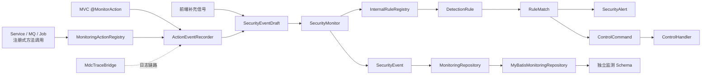
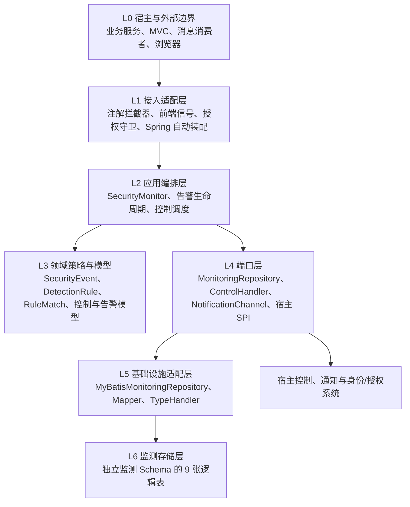
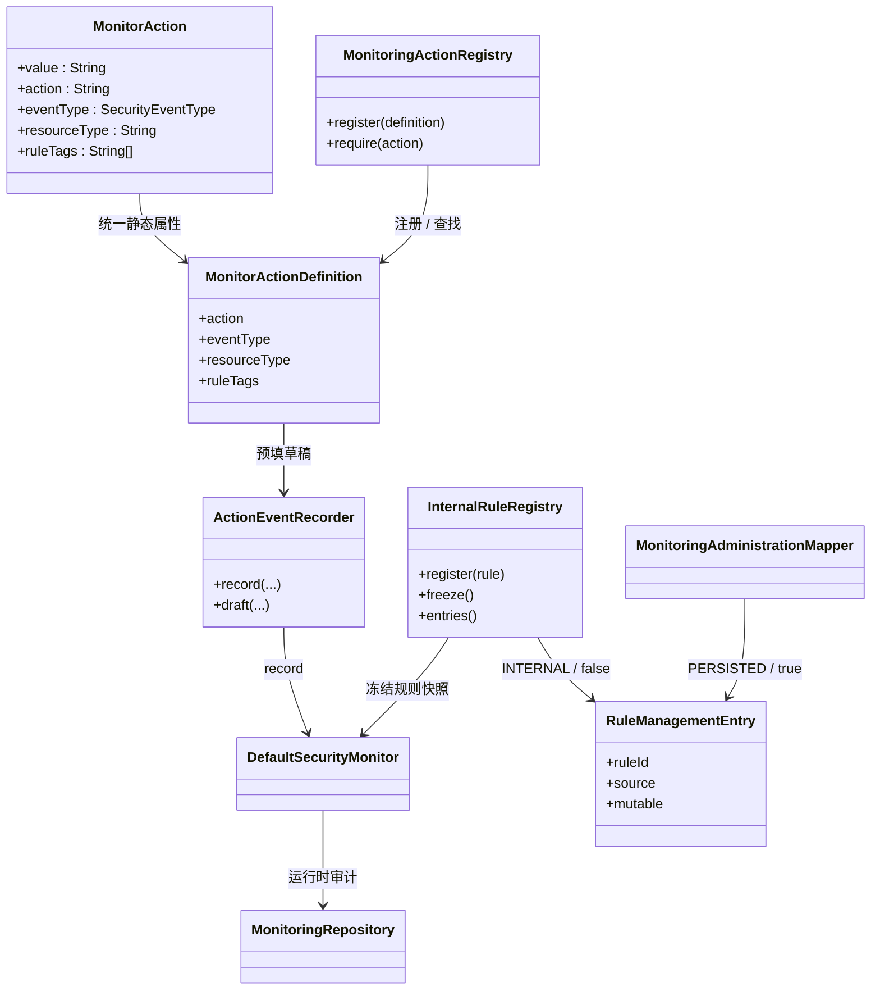
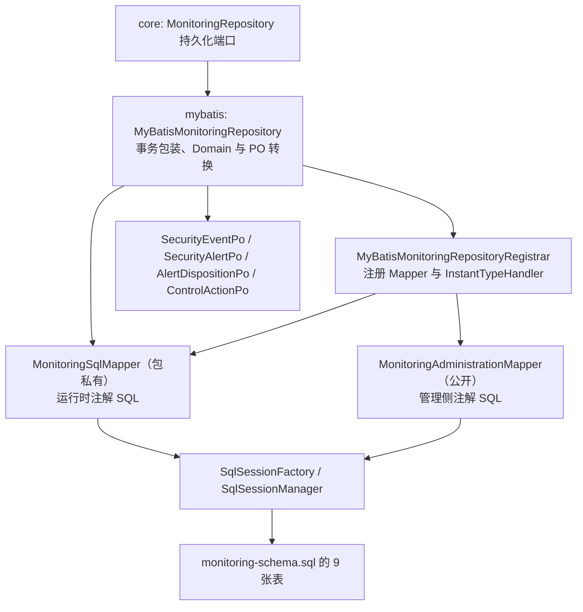
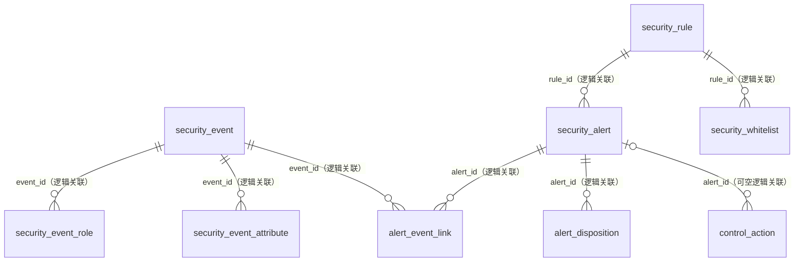
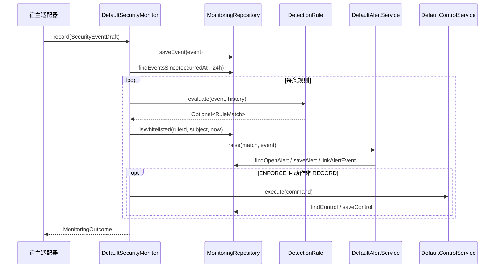

# MyBatis 标准化 ORM 与架构设计评审稿

> **评审基线**：当前仓库实现（`1.0.0-SNAPSHOT`）。本文描述已落地行为和必须确认的设计决策，不把建议项当作已实现能力。领域边界另见[领域模型与数据设计](领域模型与数据设计.md)，接入步骤另见[集成指南](集成指南.md)。

## 1. 评审结论与范围

组件采用端口与适配器架构：`api`、`core` 定义模型和业务编排；MyBatis、Spring Boot Starter 是外层适配器。生产持久化不使用 JPA 实体或自动 SQL 生成，而是采用**领域对象 + 内部 Row DTO + 注解式 Mapper + 仓储适配器**的标准 MyBatis 方式。

当前实现具备以下基础：

- 构建基线使用 MyBatis `3.5.19`，适配器只依赖稳定的 3.5.x 核心 API；Starter 不再传递或锁定 `mybatis-spring-boot-starter`。SQL 统一通过 `#{}` 参数绑定，查询显式使用 `AS` 映射为 Java `camelCase` 字段，不依赖全局下划线转驼峰开关。
- `MonitoringRepository` 是核心持久化端口；`MyBatisMonitoringRepository` 是唯一生产实现，核心层不依赖 MyBatis、Spring 或 Servlet。
- `MonitoringSqlMapper` 为包私有运行时 Mapper；公开的 `MonitoringAdministrationMapper` 面向规则版本的查询、追加、动态启停，以及人工处置和审批白名单等管理侧 SQL。
- `InstantTypeHandler` 统一将 `Instant` 映射为 JDBC `TIMESTAMP`；枚举按 MyBatis 默认枚举名称持久化为字符串。
- DDL 定义了 9 张逻辑表、必要的主键/唯一键/查询索引；生产环境仍应将脚本转换为目标数据库的 Flyway/Liquibase 版本化迁移。
- Starter 仅在宿主提供 `SqlSessionFactory` 时创建 MyBatis 仓储；缺失时回退为仅供开发/测试的内存仓储。DDL 未限定 Schema，表实际落点由 JDBC 连接的默认 Schema 决定，组件不会自动建库、建表或执行迁移。

**本次评审需要做出的关键决策**：是否始终保持“一系统一监测 Schema”、持久化规则的加载/审批/热更新模型、`ENFORCE` 多实例下的控制幂等保证等级、告警/处置的聚合事务边界、目标数据库方言与数据留存方案。

## 2. 总体架构与职责边界

### 2.1 六层架构与依赖方向

| 层级 | 主要模块/类型 | 输入与输出 | 设计约束 |
| --- | --- | --- | --- |
| L0 宿主与外部边界 | 业务服务、Controller、消息消费者、浏览器 | 产生业务事实；接收控制结果和通知 | 宿主仍是身份、授权和真实业务副作用的权威方。 |
| L1 接入适配层 | `@MonitorAction` 拦截器、`ActionEventRecorder`、`MonitoringActionRegistry`、`FrontendSignalRecorder`、`ResourceAccessGuard`、MDC 桥接、Starter 自动配置 | 将 HTTP、前端、资源访问或服务调用上下文转换为标准调用 | 只负责适配和采集；不得把客户端数据当作身份或授权结论。 |
| L2 应用编排层 | `DefaultSecurityMonitor`、`DefaultAlertService`、`AlertLifecycleService`、`DefaultControlService` | 协调持久化、规则、告警、控制和通知 | 不包含 SQL、Servlet API 或宿主具体限流/锁定代码。 |
| L3 领域策略与模型 | `SecurityEvent`、`SecurityAlert`、`RuleMatch`、`DetectionRule`、`InternalRuleRegistry`、`ControlCommand` | 表达不可变事实、规则命中和状态变化 | 内部规则在启动后冻结；规则必须是无副作用策略，领域模型不感知 MyBatis/Spring。 |
| L4 端口层 | `MonitoringRepository`、`ControlHandler`、`NotificationChannel`、身份/代理/授权 SPI | 定义核心对存储和宿主能力的依赖 | 核心只依赖接口；外层适配器反向实现接口以保持解耦。 |
| L5 基础设施适配层 | `MyBatisMonitoringRepository`、`MonitoringSqlMapper`、`MonitoringAdministrationMapper`、`InstantTypeHandler` | 把端口调用转换为参数化 SQL 和 Row DTO | 仅此层依赖 MyBatis；运行时 Mapper 不向宿主暴露。 |
| L6 监测存储层 | 9 张逻辑表、索引和默认值 | 持久化审计事实、告警摘要、处置、控制与白名单 | 当前没有外键；生产应以受控迁移创建到独立监测 Schema。 |

分层只允许依赖向内收敛：Starter 和 MyBatis 可以依赖 `core`/`api`，`core` 只能依赖 `api` 和端口接口，`api` 不依赖任何框架。`MonitoringAdministrationMapper` 是管理侧直接 SQL 边界，不能替代 `SecurityMonitor` 的运行时编排，也不会自动使规则表内容生效。

### 2.2 模块职责与边界

| 层/模块 | 职责 | 不应承担的职责 |
| --- | --- | --- |
| `api` | 事件草稿、身份/代理/授权 SPI、枚举和注解契约 | 数据库、Spring、业务权限实现 |
| `core` | 事件编排、动作/规则注册、规则判定、告警生命周期、控制幂等编排、仓储端口 | SQL、Servlet、Spring Security 或宿主控制细节 |
| `mybatis` | DDL、Mapper、`mybatis.po`、`Instant` 类型处理器、领域与 PO 转换、事务会话 | 规则判定、认证和业务阻断 |
| `spring2-starter` / `spring3-starter` | 自动装配、`SqlSessionFactory` 发现、MVC 注解采集、控制 Bean 发现 | 直接耦合宿主业务模型 |
| 宿主系统 | 服务端身份、资源授权、动态业务事实、真实限流/锁定/拒绝动作 | 修改核心规则的持久化实现 |

### 2.3 事件入口与信任边界

| 入口 | 适用范围 | 当前实现逻辑 |
| --- | --- | --- |
| `SecurityMonitor.record(SecurityEventDraft)` | 服务层、消息消费、批处理，以及需要动态资源 ID、数据量、时延的动作 | 宿主显式提供已脱敏的事实；是所有事件的统一核心入口。 |
| `@MonitorAction` | Servlet MVC 中固定的控制器动作 | `value/action`、`eventType`、`resourceType`、`ruleTags` 统一描述静态元数据；全局拦截器仅处理已标注的 `HandlerMethod`；方法注解覆盖类型注解，请求完成后映射 `SUCCESS`、`DENIED` 或 `FAILURE`。 |
| `ActionEventRecorder` + `MonitoringActionRegistry` | 服务层、消息消费、批处理，以及需要动态资源 ID、数据量、时延的动作 | 动作定义在启动期按稳定动作编码注册；`record(...)` 负责简单事件，`draft(...)` 预填可信上下文后由宿主补充动态事实。 |
| `FrontendSignalRecorder` | 浏览器补充行为 | 前端只能提供受契约限制的补充字段；身份、IP、角色、会话和最终结果由服务端上下文提供。 |
| `ResourceAccessGuard` | 资源级授权审计 | 先调用宿主 `ResourceScopeAuthorizer`，再记录允许或拒绝；空结论或异常按拒绝处理，监测失败不会放行。 |

`SecurityEventDraft` 在构建时校验必填字段、长度、非负计数和属性键，并拒绝密码、令牌、Cookie 等敏感内容；`SecurityEvent` 再由核心补充服务端事件 ID、系统 ID 和接收时间。相关实现见[草稿校验](../api/src/main/java/io/github/jasper/monitoring/api/SecurityEventDraft.java)和[监测编排](../core/src/main/java/io/github/jasper/monitoring/core/application/DefaultSecurityMonitor.java)。

### 2.4 核心类关系与统一埋点模型

注解与注册式调用只在静态元数据来源上不同：注解用于 MVC，注册用于非 MVC；两者都收敛为 `MonitorActionDefinition`。`ruleTags` 被写成统一事件属性供 `DetectionRule` 选择，不能替代动态资源、数量或业务证据。`MonitoringAdministrationMapper` 管理的是持久化版本，不直接改写 `InternalRuleRegistry`。

## 3. MyBatis 标准化 ORM 定义

### 3.1 约定

1. **命名**：表和列使用 `snake_case`；领域对象、Row DTO 和参数名使用 `camelCase`。SQL 查询必须显式别名，例如 `occurred_at AS occurredAt`。
2. **参数安全**：只允许 MyBatis `#{}` 绑定和 `@Param` 命名参数；禁止 `${}`、动态表名、动态列名和由外部输入拼接的 SQL。
3. **领域隔离**：`SecurityEvent`、`SecurityAlert`、`ControlRecord` 等保持 MyBatis 无感；只有仓储适配器负责 `Domain <-> Row` 转换。
4. **Mapper 可见性**：运行时 `MonitoringSqlMapper` 不对宿主公开；宿主需要管理写入时通过 `MonitoringAdministrationMapper` 打开 `SqlSession` 使用。
5. **时间与枚举**：所有连接和数据库默认时区必须为 UTC；`InstantTypeHandler` 使用 `Timestamp.from()` / `Timestamp.toInstant()`。枚举值是稳定的数据库契约，重命名枚举常量需配套迁移。
6. **事务**：每个仓储写方法以 `openSession(false)` 开启一个 MyBatis 事务，成功提交、运行时异常回滚；跨多个仓储方法的业务动作目前不自动组成一个总事务。
7. **迁移**：`monitoring-schema.sql` 是逻辑 DDL 基线，不由 Starter 自动执行。生产必须纳入 Flyway、Liquibase 或既有受控迁移流程，并按目标方言验证。
8. **宿主事务边界**：仓储通过 `SqlSessionManager` 管理自身的聚合事务，不通过 `SqlSessionTemplate` 或本组件的 `@Transactional` 声明参与宿主业务事务。若需要与业务数据同一原子边界，应在目标 Spring/MyBatis 配置和集成测试中明确验证，或使用 transactional outbox / 宿主批准的事务适配器。

### 3.2 ORM 组件关系

| 组件 | 可见性/责任 | 关键行为 |
| --- | --- | --- |
| `MyBatisMonitoringRepositoryRegistrar` | 公共注册器 | 幂等注册 `InstantTypeHandler`、运行时 Mapper 和管理 Mapper；不依赖 Mapper 扫描。 |
| `InstantTypeHandler` | 公共类型处理器 | `Instant <-> TIMESTAMP` 双向转换；数据库与 JDBC 连接必须统一 UTC。 |
| `MonitoringSqlMapper` | 包私有 | 注解式 `@Insert`、`@Select`、`@Update`；只描述运行时 SQL，引用 `mybatis.po` 中的 PO。 |
| `mybatis.po` | 包私有持久化对象集合 | `SecurityEventPo`、`SecurityEventAttributePo`、`SecurityAlertPo`、`AlertDispositionPo`、`ControlActionPo` 与规则版本查询投影；不进入 `api` 或核心领域层。 |
| `MyBatisMonitoringRepository` | `MonitoringRepository` 的生产适配器 | 负责事务、映射、事件子表写入、查询重建和幂等控制记录。 |
| `MonitoringAdministrationMapper` | 公共管理侧 Mapper | 查询规则版本、插入新版本、动态启停版本、追加人工处置、写入带原因/审批人的白名单。 |
| Starter 仓储选择 | Boot 自动装配 | 存在 `SqlSessionFactory` 时注册 MyBatis 适配器；否则使用 `InMemoryMonitoringRepository`，该回退不具备进程重启后的审计留存能力。 |

领域到表的标准映射如下：

| 领域聚合/值对象 | 表 | MyBatis 映射方式 |
| --- | --- | --- |
| `SecurityEvent` | `security_event`、`security_event_role`、`security_event_attribute` | `SecurityEventPo` 存根字段；角色为 `Set<String>` 子表；属性为 `Map<String,String>` 子表。 |
| `SecurityAlert` | `security_alert`、`alert_event_link` | `SecurityAlertPo` 存可变摘要；关联表记录证据事件。 |
| `AlertDisposition` | `alert_disposition` | `AlertDispositionPo` 追加写入和时间顺序读取。 |
| `ControlRecord` + `ControlCommand` + `ControlExecution` | `control_action` | `ControlActionPo` 以 `idempotency_key` 查询/更新，保留请求范围和执行结果。 |
| `WhitelistEntry` | `security_whitelist` | 核心路径仅写规则、主体、过期时间；管理路径可写原因和审批人。 |
| 规则版本元数据 | `security_rule` | 管理 Mapper 查询、追加版本和切换启停；当前不自动编译为运行时规则。 |

### 3.3 表级读写操作矩阵

下表以实际 Mapper 方法为准，区分运行时仓储与管理侧 SQL。`读`不代表管理查询能力已经实现，`写`也不代表该表拥有运行时加载逻辑。

| 表 | 运行时读取 | 运行时写入/更新 | 管理侧写入 | 事务与更新模型 |
| --- | --- | --- | --- | --- |
| `security_event` | `findEventsSince(since)` | `insertEvent(SecurityEventPo)` | 无 | 由一次监测 `inTransaction(...)` 与两张事件子表、告警摘要和关联原子提交。 |
| `security_event_role` | `findEventRoles(eventId)` | `insertEventRole(eventId, roleId)` | 无 | 事件保存时逐角色插入；复合主键防止同一事件重复角色。 |
| `security_event_attribute` | `findEventAttributes(eventId)` | `insertEventAttribute(eventId, key, value)` | 无 | 事件保存时逐属性插入；复合主键把属性键限制为事件内唯一。 |
| `security_rule` | 管理侧 `findRuleVersions()` | 当前无 | `insertRule(...)`、`setRuleEnabled(...)` | 规则正文以新版本追加，版本启停可动态更新；`rule_id + rule_version` 唯一；没有自动运行时加载 SQL。 |
| `security_alert` | `findOpenAlert(fingerprint)`、`findAlert(alertId)` | `insertAlert` 或 `updateAlert` | 无 | 加入活动监测/生命周期事务；单独调用时为独立事务。先更新、0 行时插入，不是原子去重 upsert。 |
| `alert_event_link` | `countAlertEventLink(alertId, eventId)` | `insertAlertEventLink(...)` | 无 | 先计数后插入；运行时关联事件证据，不存在数据库外键。 |
| `alert_disposition` | `findAlertDispositions(alertId)` | `insertAlertDisposition(AlertDispositionPo)` | `appendAlertDisposition(...)` | 只追加不覆盖；生命周期服务与告警状态更新在同一事务提交。 |
| `control_action` | `findControl(idempotencyKey)` | `insertControl` 或 `updateControl` | 无 | 以幂等键读写，表唯一键保护最终记录，不提供执行前原子领取。 |
| `security_whitelist` | `countActiveWhitelist(ruleId, subject, at)` | `insertWhitelist(ruleId, subject, expiresAt)` | `insertWhitelist(...)`（完整审批字段） | 核心路径依赖 DDL 默认原因/审批人；管理路径应写入真实审批信息。 |

`MonitoringAdministrationMapper` 只定义 SQL，不复用 `MyBatisMonitoringRepository.write()` 的会话包装；管理端需要从已注册 Mapper 的 `SqlSession` 取得该接口，并由调用方/宿主事务基础设施负责提交、回滚和异常处理。

### 3.4 MyBatis 适配器内部层级

运行时只有 `MyBatisMonitoringRepository` 实现 `MonitoringRepository` 并处理领域对象与 Row DTO 的双向转换；宿主不能直接访问 `MonitoringSqlMapper`。管理侧 Mapper 则刻意独立，避免把规则版本、人工处置和白名单审批混入高频事件写入链路。

## 4. 表结构字段字典与 ORM 映射

**说明**：`NN` 表示 `NOT NULL`。除 DDL 明确写出的主键、唯一键、检查约束和索引外，当前脚本**没有定义外键或级联删除**；所有关联均为应用层逻辑关联。

### 4.1 表分组、生命周期与逻辑关系

图中关系用于表达领域语义，**不是 DDL 外键**。尤其是 `security_rule` 当前仅保存规则版本，告警和白名单可以引用并未落库的运行时 `DetectionRule.ruleId`；因此不能把此图误解为当前数据库已经提供引用完整性。

| 数据组 | 表 | 一行的业务粒度 | 变化策略 | 主要写入者 |
| --- | --- | --- | --- | --- |
| 原始审计事实 | `security_event`、`security_event_role`、`security_event_attribute` | 一次服务端接收的安全事件及其角色/安全属性 | 运行时只插入；当前无数据库防更新约束 | `DefaultSecurityMonitor` 经 `MyBatisMonitoringRepository.saveEvent`。 |
| 规则管理元数据 | `security_rule` | 某规则的一份不可变版本定义 | 只插入新版本，不更新旧版本 | `MonitoringAdministrationMapper`。 |
| 告警摘要与证据 | `security_alert`、`alert_event_link` | 一个开放规则范围摘要及其事件证据 | 摘要可更新；事件关联只插入 | `DefaultAlertService`。 |
| 人工处置历史 | `alert_disposition` | 一次操作人的告警状态变更说明 | 只追加，不覆盖 | `AlertLifecycleService` 或管理 Mapper。 |
| 控制执行审计 | `control_action` | 一个幂等控制命令的一次持久化执行结果 | 同幂等键可更新结果记录 | `DefaultControlService`。 |
| 规则例外 | `security_whitelist` | 某规则对某主体至特定到期时间的抑制记录 | 只插入；到期后自然失效 | 核心仓储或管理 Mapper。 |

### 4.2 `security_event`：不可变安全事件根

映射：`SecurityEvent <-> SecurityEventPo`。仓储先插入根表，再插入角色和属性子表；索引 `idx_security_event_occurred_at(occurred_at)` 支持当前时间窗查询，`idx_security_event_subject_at(user_id, source_ip, occurred_at)` 为主体追溯预留。

| 字段 | SQL 类型/空值 | 约束/索引 | Java 映射 | 说明 |
| --- | --- | --- | --- | --- |
| `event_id` | `VARCHAR(128) NN` | 主键 | `SecurityEvent.eventId` | 服务端生成的不可变事件标识。 |
| `system_id` | `VARCHAR(128) NN` | - | `systemId` | 发出事件的宿主系统标识。 |
| `event_type` | `VARCHAR(64) NN` | - | `SecurityEventType` | 标准安全事件类别。 |
| `occurred_at` | `TIMESTAMP NN` | 时间窗索引首列 | `Instant` | 业务动作发生时间，用于规则窗口。前端信号映射会传入客户端时间，宿主必须先调用 `FrontendSignalValidator` 做时钟偏差校验。 |
| `received_at` | `TIMESTAMP NN` | - | `Instant` | 核心接受事件的服务器时间。 |
| `user_id` | `VARCHAR(128)` | 主体索引首列 | `String` | 已认证用户；匿名时可为空。 |
| `account_type` | `VARCHAR(32) NN` | - | `AccountType` | 账号类别，默认 `PERSON`。 |
| `source_ip` | `VARCHAR(128) NN` | 主体索引第二列 | `String` | 可信代理解析后的客户端地址。 |
| `device_id_hash` | `VARCHAR(256)` | - | `String` | 单向设备标识，不存原始设备 ID。 |
| `session_id_hash` | `VARCHAR(256)` | - | `String` | 单向会话标识，不存原始会话值。 |
| `request_id` | `VARCHAR(128) NN` | - | `String` | 请求关联 ID。 |
| `trace_id` | `VARCHAR(128)` | - | `String` | 分布式追踪 ID。 |
| `action` | `VARCHAR(128) NN` | - | `String` | 稳定的服务端操作名称。 |
| `result` | `VARCHAR(32) NN` | - | `SecurityEventResult` | `SUCCESS`、`FAILURE` 或 `DENIED`。 |
| `reason_code` | `VARCHAR(128)` | - | `String` | 非敏感、稳定的失败/拒绝原因码。 |
| `resource_type` | `VARCHAR(128)` | - | `String` | 逻辑资源分类。 |
| `resource_id` | `VARCHAR(256)` | - | `String` | 经批准的资源标识。 |
| `org_scope` | `VARCHAR(256)` | - | `String` | 租户、组织或数据域范围。 |
| `data_count` | `BIGINT NN` | - | `long` | 受影响记录数，草稿要求非负。 |
| `latency_ms` | `BIGINT NN` | - | `long` | 处理时延，草稿要求非负。 |

#### 字段来源与写入控制

`MonitoringSqlMapper.insertEvent(SecurityEventPo)` 一次绑定事件根表全部 20 个字段；随后由同一 `saveEvent` 事务逐项写入角色与属性子表。数据库列类型和空值约束只提供最后一道结构校验，字段可信度主要由接入层和 `SecurityEventDraft` 的构建规则保证。

| 字段组 | 权威来源/生成者 | 进入 `SecurityEvent` 的路径 | 持久化注意点 |
| --- | --- | --- | --- |
| `event_id`、`system_id`、`received_at` | `DefaultSecurityMonitor` 的 UUID、配置 `system-id` 与服务器 `Clock` | `SecurityEvent.from(...)` | 不接受浏览器或业务调用方覆盖；其中仅 `system_id` 不是当前所有表共享的隔离键。 |
| `occurred_at` | 业务调用方；前端场景为浏览器信号 | `SecurityEventDraft.occurredAt` | 前端信号必须由宿主先调用 `FrontendSignalValidator` 校时；当前 Mapper 不自动修正乱序时间。 |
| `user_id`、`account_type`、`role_ids`、`source_ip`、会话/设备哈希 | 服务端身份上下文与可信代理解析器 | 宿主 SPI 或服务层草稿 | 禁止将客户端声称的身份直接写入；原始设备/会话值应先做哈希。 |
| `request_id`、`trace_id` | 服务端请求/链路上下文 | 草稿或接入适配器 | 用于关联审计，不代表授权身份；`request_id` 为必填。 |
| `event_type`、`action`、`result`、`reason_code`、资源与组织范围 | 显式业务埋点、注解适配器或授权守卫 | 草稿 | `action`、`reason_code` 应为稳定且非敏感的代码/名称，不保存请求体、异常详情。 |
| `data_count`、`latency_ms`、`attributes` | 业务系统或经校验的前端补充事实 | 草稿 | 数值要求非负；属性按键拆行存储，禁止密码、令牌、Cookie 等敏感键。 |

### 4.3 事件子表：`security_event_role` 与 `security_event_attribute`

| 表/字段 | SQL 类型/空值 | 键 | Java 映射 | 说明 |
| --- | --- | --- | --- | --- |
| `security_event_role.event_id` | `VARCHAR(128) NN` | 复合主键第 1 列 | 事件 ID | 逻辑关联到事件根。 |
| `security_event_role.role_id` | `VARCHAR(128) NN` | 复合主键第 2 列 | `SecurityEvent.roleIds` | 一个角色一行，集合天然去重。 |
| `security_event_attribute.event_id` | `VARCHAR(128) NN` | 复合主键第 1 列 | 事件 ID | 逻辑关联到事件根。 |
| `security_event_attribute.attribute_key` | `VARCHAR(128) NN` | 复合主键第 2 列 | `attributes` 键 | 仅允许安全属性键。 |
| `security_event_attribute.attribute_value` | `VARCHAR(512) NN` | - | `attributes` 值 | 已脱敏扩展事实。 |

### 4.4 `security_rule`：规则版本管理与审计

| 字段 | SQL 类型/空值 | 约束 | Java/Mapper 映射 | 说明 |
| --- | --- | --- | --- | --- |
| `rule_id` | `VARCHAR(128) NN` | 复合主键第 1 列 | `@Param("ruleId")` | 稳定规则标识。 |
| `rule_version` | `INTEGER NN` | 复合主键第 2 列 | `int` | 不可变规则版本号。 |
| `rule_name` | `VARCHAR(256) NN` | - | `String` | 人类可读名称。 |
| `rule_definition` | `CLOB NN` | - | `String` | 规则定义文本/快照。 |
| `risk_level` | `VARCHAR(32) NN` | - | `RiskLevel` | 管理侧风险分级。 |
| `rule_mode` | `VARCHAR(32) NN` | - | `RuleMode` | 管理侧规则模式。 |
| `enabled` | `SMALLINT NN` | - | `boolean` | 是否启用；跨方言布尔映射需验收。 |
| `created_at` | `TIMESTAMP NN` | - | `Instant` | 创建时间。 |
| `created_by` | `VARCHAR(128) NN` | - | `String` | 创建者/变更操作者。 |

`MonitoringAdministrationMapper.findRuleVersions()` 返回来源为 `PERSISTED`、可变性为 `true` 的管理 DTO；`insertRule()` 负责追加新版本，`setRuleEnabled()` 负责动态切换某版本的管理启停状态。`DefaultRuleCatalog`、`DetectionRule` Bean 与 `InternalRuleContributor` 则经 `InternalRuleRegistry` 收集为来源 `INTERNAL`、可变性为 `false` 的启动期快照，创建 `DefaultSecurityMonitor` 时冻结。两类条目可以在管理端并列展示，但不能混淆为同一种可编辑资源。

**字段生命周期**：`rule_id` 由规则发布方保持稳定，`rule_version` 由管理侧负责递增，数据库不会自动分配版本号或阻止版本跳号。`rule_definition` 保存定义快照但没有 DDL 级 JSON/DSL 语法约束；规则正文、风险等级和模式改变时必须追加新版本，`enabled` 是可动态更新的管理状态。当前没有通用规则 DSL 编译器，因此持久化版本的查询或启停**不会**自动筛选、刷新或改变 JVM 内已冻结的 `DetectionRule`；上线动态加载前必须补齐定义校验、审批、灰度、缓存失效与回滚设计。

### 4.5 `security_alert`：告警可变摘要

索引：`idx_security_alert_fingerprint_status(fingerprint, status)`。开放告警查询排除 `CLOSED` 与 `FALSE_POSITIVE`，按指纹读取已有摘要后更新。

| 字段 | SQL 类型/空值 | 约束 | Java 映射 | 说明 |
| --- | --- | --- | --- | --- |
| `alert_id` | `VARCHAR(128) NN` | 主键 | `SecurityAlert.alertId` | 告警标识。 |
| `rule_id` | `VARCHAR(128) NN` | - | `ruleId` | 命中规则。表中不保存 `rule_version`，单靠告警行不能还原命中的规则版本。 |
| `risk_level` | `VARCHAR(32) NN` | - | `RiskLevel` | 告警风险等级。 |
| `fingerprint` | `VARCHAR(512) NN` | 查询索引首列 | `RuleMatch.fingerprint()` | `ruleId|subject|resourceKey` 去重键。当前无统一截断或哈希规约；规则主体和资源键接近上限时，拼接值可能超过 512，需在迁移或构造契约中处理。 |
| `subject` | `VARCHAR(256) NN` | - | `subject` | 用户、IP 或会话等响应主体。 |
| `status` | `VARCHAR(32) NN` | 查询索引第二列 | `AlertStatus` | 告警生命周期状态。 |
| `first_seen` | `TIMESTAMP NN` | - | `Instant` | 首次命中时间。 |
| `last_seen` | `TIMESTAMP NN` | - | `Instant` | 最近命中时间。 |
| `event_count` | `INTEGER NN` | - | `int` | 此摘要代表的命中次数；是告警行内的可变摘要，不由 `alert_event_link` 实时聚合计算。 |

**字段生命周期**：首次命中由 `SecurityAlert.open(...)` 写入 `NEW`、相同的 `first_seen`/`last_seen` 和 `event_count = 1`；后续命中通过 `observed(...)` 保留 `first_seen`、刷新 `last_seen` 并递增计数。领域调用保持该语义，但 SQL `UPDATE` 本身允许更新全部摘要列，因此直接使用 Mapper 时不得绕过领域服务。`event_count` 与 `alert_event_link` 的证据行数在异常或并发场景下可能不一致；`fingerprint + status` 只是普通索引而非唯一约束，不能单独保证一条开放告警。

### 4.6 `alert_event_link`：告警与原始事件关联

| 字段 | SQL 类型/空值 | 约束 | ORM 映射 | 说明 |
| --- | --- | --- | --- | --- |
| `alert_id` | `VARCHAR(128) NN` | 复合主键第 1 列 | `linkAlertEvent(alertId, eventId)` | 告警标识。 |
| `event_id` | `VARCHAR(128) NN` | 复合主键第 2 列 | 同上 | 原始证据事件。 |
| `linked_at` | `TIMESTAMP NN` | `DEFAULT CURRENT_TIMESTAMP` | 数据库默认值 | 关联写入时间；运行时 Mapper 不显式赋值。 |

**字段生命周期**：每次告警抬升后，`DefaultAlertService` 通过 `linkAlertEvent` 把本次事件作为证据关联。运行时先以复合键计数再插入，所以重复串行调用不会重复写入；并发调用仍可能发生主键冲突。`linked_at` 使用数据库默认时间，不等同于事件发生时间或告警命中时间。

### 4.7 `control_action`：控制执行审计与幂等键

| 字段 | SQL 类型/空值 | 约束 | Java 映射 | 说明 |
| --- | --- | --- | --- | --- |
| `control_id` | `VARCHAR(128) NN` | 主键 | `ControlExecution.controlId` | 控制记录标识。 |
| `idempotency_key` | `VARCHAR(256) NN` | 唯一键 | `ControlCommand.idempotencyKey` | 重放查询键。 |
| `alert_id` | `VARCHAR(128)` | - | `ControlCommand.alertId` | 来源告警；可为空。 |
| `subject` | `VARCHAR(256) NN` | - | `ControlCommand.subject` | 控制作用范围。 |
| `action_type` | `VARCHAR(64) NN` | - | `ControlActionType` | 限流、锁定、拒绝等动作。 |
| `expires_at` | `TIMESTAMP` | - | `Instant` | 临时控制到期时间。 |
| `status` | `VARCHAR(32) NN` | - | `ControlStatus` | `SUCCEEDED`、`FAILED` 或 `SKIPPED`。 |
| `failure_reason` | `VARCHAR(512)` | - | `String` | 非敏感失败说明。宿主处理器返回值与管理侧输入尚无统一长度/敏感信息清洗，需由接入层约束。 |
| `executed_at` | `TIMESTAMP NN` | - | `ControlRecord.executedAt` | 结果记录时间。 |

**字段生命周期**：`ControlCommand` 提供 `idempotency_key`、告警、主体、动作和过期时间，`ControlExecution` 提供状态和失败原因，`DefaultControlService` 使用服务器时钟生成 `executed_at`。规则触发时键固定为 `alertId:action`。同键查到历史记录时直接返回 replay；无处理器、空结果或处理器异常都会形成持久化的 `FAILED` 记录，当前不会自动发起第二次执行。

### 4.8 `alert_disposition`：告警处置追加历史

索引：`idx_alert_disposition_alert_at(alert_id, created_at)`；`disposition_type` 受 DDL `CHECK` 约束，只能为 `ACKNOWLEDGED`、`IN_PROGRESS`、`CLOSED`、`FALSE_POSITIVE`。

| 字段 | SQL 类型/空值 | 约束 | Java 映射 | 说明 |
| --- | --- | --- | --- | --- |
| `disposition_id` | `VARCHAR(128) NN` | 主键 | `AlertDisposition.dispositionId` | 追加记录 ID。 |
| `alert_id` | `VARCHAR(128) NN` | - | `alertId` | 被处置告警。 |
| `disposition_type` | `VARCHAR(64) NN` | `CHECK` | `DispositionType` | 生命周期动作。 |
| `operator_id` | `VARCHAR(128) NN` | - | `operatorId` | 已认证操作人。 |
| `comment_text` | `VARCHAR(1024)` | - | `commentText` | 操作理由；生命周期服务要求非空。管理侧须在写入前校验长度并排除敏感文本。 |
| `evidence_summary` | `VARCHAR(1024)` | - | `evidenceSummary` | 关闭时必须提供证据摘要；管理侧须在写入前校验长度并排除敏感文本。 |
| `created_at` | `TIMESTAMP NN` | 排序索引列 | `Instant` | 处置发生时间。 |

**字段生命周期**：`AlertLifecycleService` 负责校验领域状态转换、生成处置记录并追加写入，然后更新 `security_alert.status`。运行时处置服务要求评论非空，关闭类状态还需要证据摘要；而公开管理 Mapper 只提供追加 SQL，不承担同样的状态机校验，因此管理端必须复用领域服务或自行落实等价校验。`created_at + disposition_id` 是读取排序，不是并发版本列。

### 4.9 `security_whitelist`：临时规则抑制

索引：`idx_security_whitelist_lookup(rule_id, subject, expires_at)`；有效性判定为 `expires_at > at`，恰好到期时不再抑制。

| 字段 | SQL 类型/空值 | 约束 | Java/Mapper 映射 | 说明 |
| --- | --- | --- | --- | --- |
| `rule_id` | `VARCHAR(128) NN` | 复合主键第 1 列 | `WhitelistEntry.ruleId` | 被抑制规则。 |
| `subject` | `VARCHAR(256) NN` | 复合主键第 2 列 | `WhitelistEntry.subject` | 精确匹配的规则主体。 |
| `reason` | `VARCHAR(512) NN` | 默认 `Created by monitoring repository` | 管理 Mapper 参数或数据库默认 | 审批原因。 |
| `approved_by` | `VARCHAR(128) NN` | 默认 `SYSTEM` | 管理 Mapper 参数或数据库默认 | 审批人。 |
| `expires_at` | `TIMESTAMP NN` | 复合主键第 3 列 | `WhitelistEntry.expiresAt` | 必填到期时间。 |
| `created_at` | `TIMESTAMP NN` | 默认 `CURRENT_TIMESTAMP` | 管理 Mapper 参数或数据库默认 | 创建审计时间。 |

**字段生命周期**：运行时评估只按 `rule_id + subject + expires_at > now` 判断是否仍生效；它不会按 `system_id`、资源范围或 `reason` 过滤。核心 `addWhitelist` 仅写规则、主体和过期时间，故会使用 DDL 默认的 `reason`/`approved_by`；生产管理操作应改走公开管理 Mapper，明确写入审批原因、审批人和创建时间。

## 5. 核心接口与实现逻辑

| 接口/实现 | 责任 | 关键实现逻辑 | 主要持久化对象 |
| --- | --- | --- | --- |
| `SecurityMonitor` / `DefaultSecurityMonitor` | 统一事件入口 | 草稿转事件并先落库；读取事件发生时间前 24 小时历史；逐条评估规则；检查白名单；生成告警；`ENFORCE` 下为非 `RECORD` 动作创建控制命令。 | 事件、告警、关联、控制。 |
| `MonitorAction` / `MonitorActionDefinition` | 统一动作静态标记 | 注解短写或兼容属性解析为稳定动作编码、通用事件类别、静态资源类别和规则标记；动态事实不进入注解。 | `security_event` 的动作字段和属性。 |
| `MonitoringActionRegistry` / `ActionEventRecorder` | 非 MVC 方法调用埋点 | 按动作编码查找启动期定义；预填可信 IP、身份、会话、请求/追踪 ID 与服务端时间；宿主只补充动态事实。 | `security_event` 及子表。 |
| `DetectionRule` | 无副作用规则策略 | 输入当前事件和按时间排序的历史，返回 `Optional<RuleMatch>`；不得直接写库或控制。 | 无。 |
| `InternalRuleContributor` / `InternalRuleRegistry` | 内部代码规则注册 | 收集基线、`DetectionRule` Bean 和贡献者规则，按 ID 去重并在监测器创建前冻结；管理查询返回 `INTERNAL / mutable=false`。 | 无。 |
| `MonitoringAdministrationMapper` / `PersistedRuleDefinition` | 持久化规则管理查询 | 查询规则版本、追加定义版本、切换版本启停；管理查询返回 `PERSISTED / mutable=true`，不自动编译或热加载。 | `security_rule`。 |
| `MonitoringRepository` / `MyBatisMonitoringRepository` | 持久化端口与适配器 | `inTransaction(...)` 定义聚合一致性边界；适配器以 MyBatis `SqlSessionManager` 复用嵌套调用的同一受管会话，负责领域/PO 双向转换。 | 全部监测表。 |
| `DefaultAlertService` | 告警去重与持久化 | 按指纹找开放告警，存在则刷新摘要，否则新建；保存后关联事件。通知由提交后的应用编排执行。 | `security_alert`、`alert_event_link`。 |
| `AlertLifecycleService` | 人工告警闭环 | 在同一 `inTransaction(...)` 回调中校验状态迁移、追加处置记录并更新告警摘要状态。 | `alert_disposition`、`security_alert`。 |
| `DefaultControlService` | 控制调度与审计 | 先按幂等键查询；无历史时找第一个支持动作的宿主处理器，执行并保存结果。规则触发的键固定为 `alertId:action`；无处理器或首次执行失败也会保存 `FAILED`。 | `control_action`。 |
| `ControlHandler` / `AnnotatedControlHandler` | 宿主真实控制 | 宿主实现限流、锁定、撤销会话、拒绝等；注解绑定可延迟取得 Spring Bean，避免启动循环依赖。 | 由 `DefaultControlService` 记录结果。 |
| `ResourceAccessGuard` | 授权结论审计 | 宿主授权优先；异常和空结论 fail-closed；记录本身失败不改变授权结论。 | `security_event`。 |

### 5.1 运行时时序

### 5.2 事务与查询语义

| 操作 | 当前事务边界 | 正确性语义 | 评审关注点 |
| --- | --- | --- | --- |
| 事件监测聚合 | `inTransaction(...)` 的单个 MyBatis 管理会话 | 根事件、角色、属性、规则读取、告警摘要和事件关联要么一起提交，要么一起回滚。 | 满足一次记录的审计聚合原子性。 |
| `findEventsSince` | 在聚合内加入当前受管会话；单独调用时使用只读受管会话 | 先读事件根，再每个事件读角色和属性。 | 当前为 `1 + 2N` 查询；高流量需优化。 |
| `saveAlert` / `linkAlertEvent` / `addWhitelist` | 加入活动聚合；单独调用时开启独立事务 | `UPDATE alert_id` 为 0 时执行 `INSERT`；关联和白名单仍先 `COUNT` 再 `INSERT`。 | 并发下仍有告警 upsert 和主键冲突竞态。 |
| 告警处置转换 | `inTransaction(...)` 的单个 MyBatis 管理会话 | 追加 `alert_disposition` 与更新 `security_alert` 原子提交。 | 事务回滚已由 H2 集成测试覆盖。 |
| 控制执行 | 查询、宿主执行、保存结果分别发生 | 同一开放告警的规则触发键固定为 `alertId:action`；已有记录（包括 `FAILED`）直接返回 replay，不会自动重试；无记录才调宿主。 | **多实例无法仅靠唯一键阻止重复宿主动作**；宿主必须处理幂等与失败补偿。 |

### 5.3 启动装配逻辑

1. Boot 2/Boot 3 Starter 读取 `abnormal.access.monitor.*` 配置，构造 `Clock`、MDC 追踪桥接、动作注册表、通知通道和宿主 SPI 的适配集合。
2. 若应用上下文存在 `SqlSessionFactory`，Starter 通过 `MyBatisMonitoringRepositoryRegistrar` 注册 `InstantTypeHandler`、内部运行时 Mapper 和管理 Mapper，并创建 `MyBatisMonitoringRepository`；否则创建 `InMemoryMonitoringRepository`。后者只适用于本地开发或测试。
3. Starter 收集 `DefaultRuleCatalog`、`DetectionRule` Bean 和 `InternalRuleContributor` 到 `InternalRuleRegistry`，创建监测器前冻结该快照；若配置为 `ENFORCE` 但没有任何 `ControlHandler`，构造阶段失败。
4. 当注解采集开关启用时，MVC 拦截器只记录标注 `@MonitorAction` 的处理器；`@ControlTrigger` 标注的公开 Spring Bean 方法被适配为 `ControlHandler`。请求适配器把同一个 `traceId` 写入监测上下文和可选日志 MDC，并在请求结束恢复原值。这些机制只在接入层发生，`core` 不依赖 Servlet/Spring 类型。
5. 宿主业务、前端端点或资源授权流程最终都收敛到 `SecurityMonitor.record(SecurityEventDraft)`；持久化、规则和控制接口由应用编排层统一调用。持久化规则的动态管理不会自动改变已冻结规则快照。

### 5.4 四类核心业务链路

| 链路 | 分层调用 | 已落地处理步骤 | 写入结果与失败语义 |
| --- | --- | --- | --- |
| 事件监测 | L0/L1 -> L2 -> L3/L4 -> L5/L6 | 草稿校验；`SecurityEvent.from` 服务端补齐 ID/系统/接收时间；在一个 `inTransaction(...)` 中写事件、读取 24 小时历史并逐条执行 `DetectionRule`。 | 事件、角色、属性、告警摘要和关联原子提交。普通 `record` 调用的持久化异常会向调用方返回；`ResourceAccessGuard` 专门吞掉监测异常以不改变既有授权结论。 |
| 告警抬升 | L2 -> L3 -> L4 -> L5/L6 -> 通知端口 | 对每个 `RuleMatch` 先查白名单；按指纹查询开放告警；新建或刷新摘要；关联当前事件；提交后调用通知通道。 | 持久化数据与事件关联同事务；通知失败不回滚已提交告警，开放告警查询/保存仍没有并发去重原子性。 |
| 人工处置 | L0 管理端 -> L2 -> L3/L4 -> L5/L6 | 在同一 `inTransaction(...)` 中校验状态迁移与处置内容、追加 `AlertDisposition`、更新告警摘要状态。 | 两张表的变化原子提交；管理端仍须处理验证失败和权限审计。 |
| 控制执行 | L2 -> L4 宿主处理器 -> L5/L6 | 按幂等键查历史；无历史时定位第一个支持动作的 `ControlHandler`；执行；将结果存为 `ControlRecord`。 | 控制失败转为 `ControlExecution.FAILED`，不把处理器异常传播到业务流程；多节点并发时外部副作用仍需宿主按键去重。 |
| 规则/白名单管理 | L0 管理端 -> L5 管理 Mapper -> L6 | 查询规则版本、追加规则版本、动态启停版本、追加人工处置或审批白名单。 | 管理 Mapper 返回 `PERSISTED / mutable=true`；不会触发规则重新加载、告警重算或缓存失效。 |

## 6. 必须评审确认的风险与决策

| 编号 | 当前事实 | 风险/影响 | 评审需要确认的决策 |
| --- | --- | --- | --- |
| R-01 系统隔离 | 只有 `security_event` 有 `system_id`；历史、告警、白名单和控制查询不带系统条件。 | 共享库会混合不同系统的规则历史、告警与抑制结果。 | 当前保持**一系统一 Schema/库**；若要共享库，需全表补充系统维度、复合键、索引和查询条件。 |
| R-02 规则来源 | `InternalRuleRegistry` 已明确为 `INTERNAL / immutable`；`security_rule` 已可查询、追加版本和动态启停，为 `PERSISTED / mutable`。当前运行时只使用冻结的内部规则快照。 | 管理表动态状态与实际生效规则仍可能不同步。 | 若持久化规则要成为运行时来源，必须设计加载、定义校验、审批、灰度、缓存失效、回滚和版本与告警的可追溯关系。 |
| R-03 告警并发 | `findOpenAlert -> saveAlert` 无版本列、锁或开放指纹唯一约束。 | 多实例可能产生重复开放告警或丢失计数更新。 | 采用目标方言的原子 upsert/部分唯一索引/乐观锁，或限制为单写入者。 |
| R-04 控制幂等与重试 | `findControl -> 执行宿主 -> saveControl`，唯一键只保护最终记录；规则命令键是 `alertId:action`，首次无处理器或失败同样保存 `FAILED`。 | 并发节点可能都执行一次宿主限流/锁定；同键失败以后只会 replay，当前没有自动重试。 | 宿主必须按 `idempotencyKey` 幂等并提供补偿；强保证时引入原子领取 `PENDING` 状态机、重试策略或分布式锁。 |
| R-05 聚合事务 | 事件、规则判定、告警/关联和告警处置已通过 `inTransaction(...)` 在同一 `SqlSessionManager` 会话中完成；控制处理器在提交后执行。 | 外部控制和通知不能被数据库回滚，且监测事务不自动加入宿主业务事务。 | 跨资源原子性使用 transactional outbox 或宿主批准的事务适配器；不得把外部控制放入数据库回滚范围。 |
| R-06 查询容量 | 每次规则计算读取 24 小时历史，角色/属性按事件逐条查询。 | 事件量增长会造成窗口扫描和 `1+2N` 查询压力。 | 确认日事件量、保留期和规则窗口；设计分区、归档、批量子表加载、投影或预聚合。 |
| R-07 方言与时区 | DDL 使用 `TIMESTAMP`、`CLOB`、`SMALLINT`、`CHECK`；测试使用 H2 PostgreSQL 模式。 | 真实 PostgreSQL/MySQL/Oracle 的布尔、CLOB、时间精度和 UTC 语义可能不同。 | 确定目标数据库；产出方言化迁移和 Testcontainers 回归。 |
| R-08 审计完整性 | DDL 无外键；核心白名单写入依赖默认审批人 `SYSTEM`。 | 归档/删除可能留下孤儿数据；生产白名单审计不足。 | 明确是否加外键或由迁移任务维护一致性；生产审批使用管理 Mapper 写入真实原因和审批人。 |
| R-09 字段边界与敏感数据 | `fingerprint` 由未规约字符串拼接，列长为 512；处置文本、控制失败原因和管理 Mapper 输入没有统一的长度/脱敏入口。 | 最大输入可能写入失败；审计库可能留下不应保存的敏感内容。 | 确认指纹改为固定长度哈希、扩大列或收紧长度契约；制定管理接口和宿主处理器的校验、脱敏与导出审批规范。 |
| R-10 前端事件时间 | `FrontendSignalMapper` 直接采用浏览器 `occurred_at`；`FrontendSignalValidator` 已提供但不会由 Mapper 自动调用。 | 未校时的客户端时间可改变规则窗口，乱序事件还可能读到已落库的“未来”事件。 | 宿主端点必须在映射前校验时钟偏差并记录拒绝策略；评审是否改用服务器接收时间或引入事件时间上界。 |
| R-11 存储落点与迁移 | 未配置 `SqlSessionFactory` 会回退内存仓储；DDL 表名未限定 Schema，Starter 不自动执行建表。 | 生产误配会丢失重启后的审计数据，或将表落到非预期默认 Schema。 | 在部署清单中强制数据源、Schema、迁移版本与启动自检；生产 profile 禁止或告警内存仓储回退。 |

## 7. 验证依据与建议验收

现有最小验收已覆盖：注解短写、统一规则标记、注册式动作草稿和动态事实（`ActionEventRecorderTest`）；内部规则冻结（`InternalRuleRegistryTest` 与两个 Starter 测试）；持久化规则版本查询/动态启停及事务回滚（`MyBatisMonitoringRepositoryTest`）；Boot 2/3 的 MVC 注解、控制发现与 MDC 追踪恢复。MyBatis 集成测试使用 `jdbc:h2:mem:...;MODE=PostgreSQL`，当前尚未覆盖真实目标数据库、并发告警去重、并发控制领取和迁移升级。

建议在评审结论后至少补齐：

1. 目标数据库 Testcontainers 迁移与 Mapper 回归。
2. 多实例并发下同一告警指纹和同一 `idempotency_key` 的压力测试。
3. 告警处置、告警关联、白名单写入失败时的一致性/补偿测试。
4. 最大规则窗口下的事件量、索引命中和 `1+2N` 查询容量测试。
5. 留存、归档和删除演练，确认子表和关联表不产生孤儿记录。
6. 前端时钟偏差、指纹最大长度、处置文本/控制失败原因脱敏与超长拒绝测试。
7. 缺失 `SqlSessionFactory`、错误默认 Schema 和未执行迁移时的生产启动自检测试。

**评审签署建议**：在 R-01 至 R-11 中至少明确数据库部署边界、目标方言、规则来源、前端时间信任模型和 `ENFORCE` 幂等保证等级后，再将该设计作为生产迁移基线。
