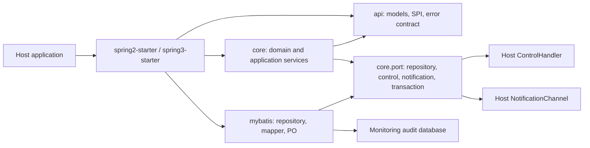
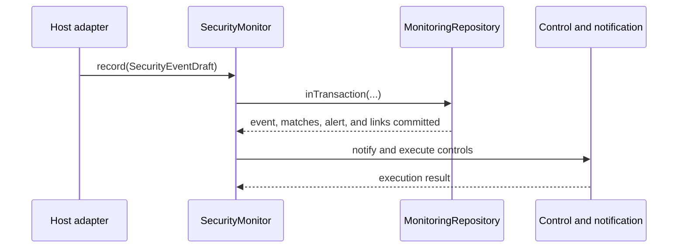

# Architecture and Transaction Boundaries

[Back to the English README](../README.en.md)

## Dependency direction

The reactor keeps technology and host concerns outside the monitoring domain:

| Layer | Packages | Responsibility |
| --- | --- | --- |
| Contracts | `api` | Framework-neutral input models and host SPIs. |
| Domain | `core.domain`, `core.domain.rule` | Immutable audit facts and deterministic, side-effect-free rules. |
| Application | `core.application` | Monitoring, alert lifecycle, control orchestration, and action recording. |
| Ports | `core.port` | Persistence, notifications, host controls, and the transaction boundary. |
| Adapters | `mybatis`, `spring-*`, `web-contract` | Database, Spring Boot, Servlet, and browser integration. |

`core` depends only on `api` and the JDK. Domain rules must not import Spring, MyBatis, Servlet APIs, or host authorization implementations. A host supplies identity, authorization, proxy resolution, notification, and control behavior through the published contracts.

`mybatis.po` is private database-row mapping. It does not enter `api` or replace immutable `core.domain` objects. `MyBatisMonitoringRepository` is the sole domain/PO conversion boundary.

## Monitoring transactions

`MonitoringRepository.inTransaction(...)` is the persistence boundary for monitoring state. A normal record operation commits the security event, history-based evaluation, alert snapshot, and event-to-alert link in one transaction. An alert lifecycle transition commits the new status and its append-only disposition record together.

The MyBatis adapter uses MyBatis `SqlSessionManager` rather than manually duplicating session lifecycle code. Nested repository calls join the managed session. A runtime failure rolls the complete callback back; the focused H2 test covers this behavior.

Notifications and host control handlers run only after a successful monitoring commit. They are external side effects and cannot be rolled back safely. The repository transaction is intentionally isolated from a host application's business transaction. Where both must be atomic, the host should use a transactional outbox or provide an approved integration adapter; do not assume that an annotation on a business service magically includes the monitoring session.

## MyBatis compatibility

The parent build compiles against MyBatis `3.5.19`, but the monitoring adapter uses only stable MyBatis 3.5.x core APIs. Spring Boot 2 and 3 starters no longer bring or pin `mybatis-spring-boot-starter`. Applications can keep their own compatible MyBatis or MyBatis-Spring-Boot version and simply expose a configured `SqlSessionFactory`.

The `mybatis` module registers its mapper and `InstantTypeHandler` idempotently through `MyBatisMonitoringRepositoryRegistrar`. It does not scan host packages, create tables, or prescribe a mapper framework. Run the controlled migration at `mybatis/src/main/resources/db/monitoring-schema.sql` before enabling the persistent adapter.

## Upgrade note

The former flat `io.github.jasper.monitoring.core` namespace was split into `domain`, `application`, `port`, and `infrastructure.memory`. Update direct imports accordingly. Host integration contracts remain in `api`; framework-specific entry points remain in the Spring starter modules.
