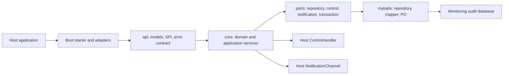
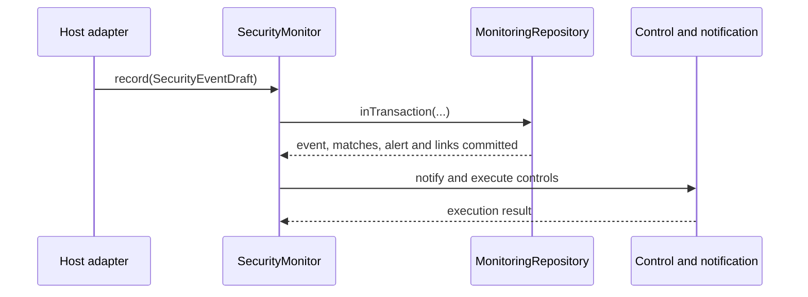

# Public Error Contract and Bilingual Documentation Design

**Status:** Approved on 2026-07-23

## Goal

Expose a framework-neutral, backward-compatible monitoring error contract and
make the component practical to integrate, operate, and evolve through aligned
Chinese and English documentation.

## Scope and Boundaries

- The component exposes stable error codes and typed runtime exceptions.
- The component does not define HTTP status codes, response JSON, RPC status
  values, or message-broker failure envelopes. The host owns those mappings.
- Error messages and exception causes must not include passwords, tokens,
  cookies, raw request or response bodies, raw SQL, or other sensitive payloads.
- Existing callers that catch `IllegalArgumentException` or
  `IllegalStateException` keep working because the compatible public exceptions
  inherit from those types.
- MyBatis remains an adapter. Its exception details are preserved as a cause,
  but no MyBatis type leaks into `api`.

## Public Error Model

Create `io.github.jasper.monitoring.api.error` with these public types:

| Type | Responsibility | Compatibility base class |
| --- | --- | --- |
| `MonitoringErrorCode` | Stable, documented machine-readable code | N/A |
| `MonitoringFailure` | Exposes `getErrorCode()` for all public failures | N/A |
| `MonitoringValidationException` | Invalid or unsafe caller input | `IllegalArgumentException` |
| `MonitoringConfigurationException` | Invalid startup or host wiring | `IllegalStateException` |
| `MonitoringStateException` | Illegal lifecycle or registry transition | `IllegalStateException` |
| `MonitoringPersistenceException` | Monitoring storage could not complete | `RuntimeException` |

Every exception accepts a `MonitoringErrorCode`, a safe message, and an
optional cause. The code is the stable contract; the message is diagnostic only
and must not be parsed by consumers.

`MonitoringErrorCode` starts with the following exact values. Values may be
added in a future minor release, but assigned code strings and their documented
meaning are not renamed or reused.

| Code | Name | Primary consumer action |
| --- | --- | --- |
| `MON-001` | `REQUIRED_FIELD_MISSING` | Correct the caller input; do not retry unchanged. |
| `MON-002` | `INVALID_FIELD_VALUE` | Correct the value or format; do not retry unchanged. |
| `MON-003` | `UNSAFE_EVENT_ATTRIBUTE` | Remove sensitive or unsupported attributes. |
| `MON-101` | `ACTION_NOT_REGISTERED` | Register one static action definition before recording. |
| `MON-102` | `CONFLICTING_ACTION_DEFINITION` | Make every registration for the action identical. |
| `MON-103` | `RULE_REGISTRY_FROZEN` | Register rules before monitor construction. |
| `MON-104` | `DUPLICATE_CONTROL_BINDING` | Keep one host control binding for each action. |
| `MON-201` | `ALERT_NOT_FOUND` | Refresh the alert identifier; do not retry unchanged. |
| `MON-202` | `INVALID_ALERT_TRANSITION` | Reload alert state and select a permitted transition. |
| `MON-301` | `ENFORCEMENT_HANDLER_REQUIRED` | Add and validate a host `ControlHandler` before `ENFORCE`. |
| `MON-401` | `PERSISTENCE_OPERATION_FAILED` | Inspect the cause and database health; retry only via an idempotent host policy. |

The implementation replaces only public validation, configuration, lifecycle,
registration, and repository-boundary failures whose meaning is known. It does
not convert every unexpected `RuntimeException` into a generic monitoring
failure, because doing so would hide programming defects and lose diagnostics.

## Runtime Architecture

The transaction contains monitoring event persistence, rule evaluation output,
alert persistence, and event-to-alert links. Notification and host control run
after commit so an irreversible side effect cannot be rolled back with audit
data. The transaction intentionally does not join the host business
transaction; hosts needing cross-resource atomicity use their own approved
outbox or transaction adapter.

## Documentation Information Architecture

Keep existing paths working and assign each document a single reader goal.

| Document | Reader goal | Change |
| --- | --- | --- |
| `README.md` and `README.en.md` | Find the correct module and start safely | Add a five-minute path, prerequisites, document navigation, and `OBSERVE` first rule. |
| `docs/集成指南.md` and `docs/integration-guide.en.md` | Integrate the component in an application | Add a 15-minute walkthrough, common omissions, production acceptance, advanced integrations, and links to the error contract. |
| `docs/错误规范.md` and `docs/error-contract.en.md` | Consume and map component failures | Publish the code table, exception hierarchy, retry guidance, host mapping boundary, and safe logging rule. |
| `docs/架构与运维说明.md` and `docs/architecture-and-transaction-boundaries.en.md` | Understand runtime ownership and operations | Add the module and call-flow Mermaid diagrams plus transaction and post-commit boundaries. |
| `docs/路线图.md` and `docs/roadmap.en.md` | Plan upgrades and contribution work | Publish prioritised milestones, scope, acceptance criteria, and explicitly deferred work. |

The detailed Chinese documents `docs/领域模型与数据设计.md` and
`docs/MyBatis标准化ORM与架构设计评审稿.md` remain specialist references. The
new English entry points link to them only when the reader needs implementation
detail, avoiding duplicated tutorial material in the README.

The quick-start path has these verifiable steps: import exactly one Boot
starter, run the controlled schema migration, provide trusted identity and
authorization SPI implementations, configure trusted proxies, start in
`OBSERVE`, submit a safe test event, confirm the audit rows, and only then
validate a real `ControlHandler` before enabling `ENFORCE`.

The common omissions section explicitly covers a missing schema, accidental
in-memory repository fallback, two starters on one classpath, anonymous
identity left in production, untrusted forwarding headers, `ENFORCE` without a
validated control action, unregistered manual actions, sensitive event fields,
frontend telemetry treated as authoritative, and database rules mistaken for
active runtime rules.

The advanced section covers `@MonitorAction`, `MonitoringActionRegistry` and
`ActionEventRecorder`, `@ControlTrigger`, `ResourceAccessGuard`, frontend
signal validation, MDC trace propagation, notification channels, custom
`DetectionRule` registration, MyBatis transaction behavior, and the dynamic
rule-management boundary.

## Verification

- Add focused unit tests that assert the error code and compatibility base class
  for each migrated validation, configuration, lifecycle, and registry path.
- Add an H2 MyBatis test that confirms a persistence failure is surfaced with
  `MON-401` and retains its cause.
- Keep Spring Boot 2 and 3 tests in parity for missing `ControlHandler` in
  `ENFORCE` and duplicate control-trigger bindings.
- Run `mvn clean verify -DskipTests=false` after the implementation.
- Check every changed Markdown link locally and ensure each Mermaid block has a
  balanced graph definition and names only real modules or public types.

## Milestone Backlog

| Milestone | Priority | Scope | Completion signal |
| --- | --- | --- | --- |
| M0: Error contract and integration docs | Now | This design: public error codes, compatible exceptions, bilingual guides, diagrams, and roadmap | API and full reactor tests pass; all new documents link from both READMEs. |
| M1: Operational observability and retention | Next | Metrics SPI, monitoring health guidance, retention and archival policy | Operators can measure delivery, persistence, control success, and data age without inspecting raw events. |
| M2: Reliable external delivery | Later | Approved transactional-outbox adapter and idempotent notification delivery guidance | Notification delivery is recoverable without coupling to the host transaction. |
| M3: Governed dynamic rules | Later | Validated, versioned, staged runtime rule loader with audit and rollback | A database rule can affect runtime only after validation, approval, and controlled rollout. |

The component intentionally does not schedule automatic schema migration,
automatic online activation of database rules, automatic discovery of
`EventEnricher`, or a built-in HTTP error envelope. Each would either violate
host ownership or broaden the framework-neutral core without a demonstrated
need.
