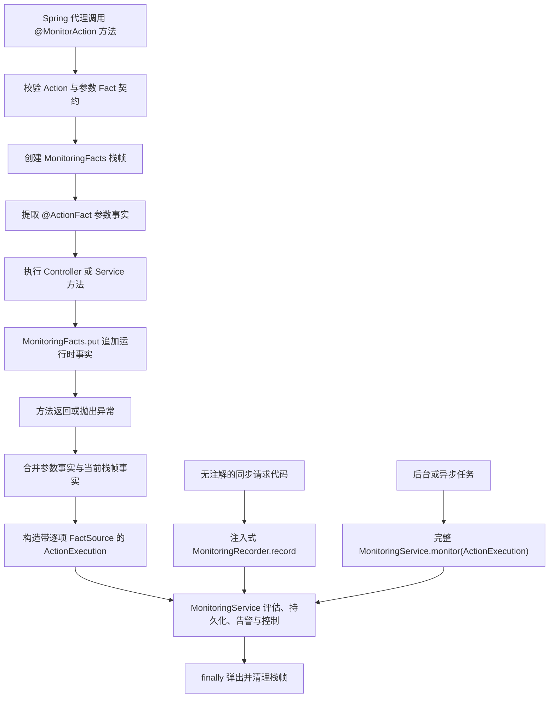

# 注解监听运行时事实作用域设计

## 背景

当前 `@MonitorAction` 切面只在方法执行前通过 `@ActionFact` 提取参数事实。业务方法执行后才能确定的服务端事实，例如实际导出行数、敏感级别和最终资源标识，只能通过完整的 `MonitoringService.monitor(ActionExecution)` 显式提交。该方式能够准确表达事实来源，但样板代码较多，也不能与注解监听自然组合。

本设计增加一个同步调用作用域，使已被 `@MonitorAction` 拦截的方法可以在方法体内通过类型安全的静态 API 追加事实。同时提供一个注入式简化记录器，作为不适合注解监听场景的显式入口。

## 目标

- 允许 Controller 或普通 Spring Bean 的受监听公开方法在方法体内追加服务端事实。
- 参数事实继续记录为 `METHOD_PARAMETER`，运行时追加事实记录为 `HOST_PROVIDER`。
- 正确处理嵌套监听、并发调用、异常路径和线程池复用。
- 没有活动监听作用域时不静默丢弃追加操作，而是记录警告并返回失败状态。
- 保留现有 `ActionExecution.of(..., facts, source)` 和 `MonitoringService.monitor(...)` 的兼容性。
- 为显式记录提供减少样板代码的注入式入口。
- 为注解监听提供独立专题文档，说明架构、调用关系和适用边界。

## 非目标

- 不将事实作用域传播到异步线程、线程池任务或响应式执行链。
- 不让 `@MonitorAction` 自动支持非 Spring 对象、静态方法、私有方法或代理自调用。
- 不提供通过全局 Spring 容器定位服务的静态事件提交 API。
- 不替代宿主业务授权、事务结果判断或服务端事实计算。
- 不改变普通 HTTP 请求不会自动产生业务事件的现有边界。

## 总体架构



## 组件设计

### MonitoringFacts

`spring-support` 新增公开静态门面 `MonitoringFacts`：

```java
public static <T> boolean put(Class<? extends FactType<T>> factType, T value);
```

该方法只写入当前线程最内层的活动监听作用域。成功写入返回 `true`。没有活动作用域时使用 `java.util.logging` 记录 `WARNING` 并返回 `false`，业务调用继续执行。`factType` 或 `value` 为 `null` 时立即抛出参数异常。

业务代码不负责打开或关闭作用域。`spring-support` 提供供 starter 切面调用的作用域管理 SPI，避免三套 starter 分别实现线程状态。

### 栈式事实作用域

作用域状态使用 `ThreadLocal<Deque<Scope>>`：

- 每次切面拦截压入一个新帧。
- `MonitoringFacts.put` 只操作栈顶帧。
- 同一帧重复写入相同 Fact 类型时抛出冲突异常，不覆盖原值。
- 内层受监听方法只消费内层帧；其事实不向外层传播。
- 外层方法在内层调用前后追加的事实仍归属外层帧。
- 切面在 `finally` 中弹出帧；栈为空时调用 `ThreadLocal.remove()`。
- 使用普通 `ThreadLocal`，不使用 `InheritableThreadLocal`，防止事实意外进入子线程或线程池。

### 逐项事实来源

当前 `ActionExecution` 为整组 supplied facts 保存一个 `FactSource`。为支持参数事实和运行时事实共存，接口新增逐项来源视图，并为旧实现提供兼容默认值。现有单来源工厂方法保持不变，新工厂方法允许传入与事实键完全对应的来源映射。

`DefaultMonitoringRuntime` 按每项事实来源执行 Action 允许来源、FactDefinition 允许来源、重复生产者和持久化快照校验。参数事实使用 `METHOD_PARAMETER`，运行时事实使用 `HOST_PROVIDER`。

来源映射缺项、多项或包含不属于 supplied facts 的 Fact 类型时必须拒绝，不能推断或静默修复。

### TypedMonitorActionAspect

Spring 2、Spring 3 和 Spring 2 Legacy 切面保持行为一致：

1. 校验方法契约并提取参数事实。
2. 打开新的运行时事实帧。
3. 调用业务方法。
4. 根据返回值或异常形成 `ActionOutcome`。
5. 消费当前帧并与参数事实合并。
6. 对参数事实与运行时事实的同类型重复执行冲突检查。
7. 使用逐项来源构造 `ActionExecution` 并调用 `MonitoringService`。
8. 在所有路径中关闭作用域。

业务方法抛出异常时，已经追加的事实仍可进入失败事件。若监测提交也失败，保持现有行为：监测异常作为 suppressed exception 附加到原始业务异常。

### MonitoringRecorder

`spring-support` 新增可注入的 `MonitoringRecorder`，starter 在 Servlet Web 应用中自动配置：

```java
public AssemblyResult record(
    Class<? extends ActionType> actionType,
    ActionOutcome outcome,
    ActionFacts facts);
```

记录器从 `MonitoringContextAccessor` 取得当前可信请求和身份上下文，并以 `HOST_PROVIDER` 提交事实。它适用于无注解的同步 HTTP 请求代码，减少显式构造 `ActionExecution` 的样板。

定时任务、消息消费和异步线程没有 Servlet 请求上下文，继续使用完整的 `MonitoringService.monitor(ActionExecution)`，由宿主明确提供请求和身份语义。

## 普通方法适用范围

`@MonitorAction` 的匹配不限制 Controller 类型，因此 Servlet 应用中的普通 Spring Bean `public` 方法可以被监听，但必须满足 Spring AOP 边界：

- 对象必须由 Spring 管理。
- 调用必须经过 Spring 代理。
- `this.method()` 自调用不会建立新监听作用域。
- 私有、静态以及无法代理的 final 方法不在支持范围内。
- `new` 创建的对象不受监听。
- 当前自动配置只在 Servlet Web 应用中启用；后台执行使用显式入口。

集成审计必须增加 Controller 调用普通 `@Service` 公开方法的用例，并由该 Service 在方法体中追加事实，以证明作用域不依赖 Controller 方法本身。

## 冲突与失败语义

| 场景 | 行为 |
| --- | --- |
| 无活动作用域调用 `put` | 记录 `WARNING`，返回 `false` |
| 同一帧重复追加同类型 Fact | 立即抛出冲突异常 |
| 参数 Fact 与运行时 Fact 重复 | 合并时抛出冲突异常 |
| 运行时 Fact 与 FactBinding 重复 | 沿用 runtime 多来源冲突校验 |
| Action 未声明运行时 Fact | runtime 拒绝提交 |
| Action 或 FactDefinition 不允许 `HOST_PROVIDER` | runtime 拒绝提交 |
| 逐项来源映射与 Fact 集合不一致 | 构造或收集时拒绝 |
| 异步线程调用 `put` | 视为无活动作用域，警告并返回 `false` |
| 业务方法抛出异常 | 尝试记录失败事件，随后清理作用域并重抛原异常 |

监测失败不会让事实留在线程中。任何退出路径都必须执行栈帧身份校验和清理；错误关闭非栈顶帧应抛出状态异常，以暴露切面生命周期错误。

## 并发与嵌套保证

- 不存在跨线程共享的可变 Fact Map。
- 同一 Spring Bean 被并发调用时，每个线程拥有独立栈。
- 嵌套代理调用按栈深度隔离，内外层独立产生事件。
- 线程池线程完成调用后不保留空栈或事实值。
- 不承诺跨 `CompletableFuture`、`@Async`、Reactor 或手工线程的上下文传播。

## 测试策略

### API 与 Core

- 旧单来源 `ActionExecution` 工厂方法继续工作。
- 新逐项来源工厂保留每个 Fact 的来源。
- 来源映射缺失、额外或空值被拒绝。
- runtime 使用逐项来源执行允许来源和持久化快照校验。

### Spring Support

- 活动作用域内 `put` 成功。
- 无作用域时警告并返回 `false`。
- 同帧重复 Fact 被拒绝。
- 嵌套帧互不覆盖。
- 两个并发线程的事实互不泄漏。
- 异常关闭和正常关闭后均无残留状态。
- `MonitoringRecorder` 自动使用当前请求、身份和 `HOST_PROVIDER`。

### Starter

三套 starter 保持对称测试：

- 参数事实与运行时事实合并并保留不同来源。
- 参数与运行时重复 Fact 被拒绝。
- 成功、拒绝和业务异常事件消费正确帧。
- 嵌套监听产生两组独立事实。
- 未经过代理的调用不能获得活动作用域，并产生警告结果。

### 集成审计

Spring 2 和 Spring 3 各增加对应验收：

- Controller 调用普通 Spring Service 的受监听公开方法。
- Service 在计算完成后调用 `MonitoringFacts.put`。
- 数据库事实值来自服务端计算结果，来源为 `HOST_PROVIDER`。
- 客户端输入不能覆盖服务端事实。
- Boot 2/3 验收编号集合继续保持一致。

## 文档交付

新增 `docs/注解监听与运行时事实作用域.md`，内容包括：

- 注解监听总体架构和调用时序。
- Controller 与普通 Service 的适用方式。
- `@ActionFact` 与 `MonitoringFacts.put` 的选择标准。
- 嵌套、并发、异常、自调用和异步边界。
- `MonitoringRecorder.record` 与完整 `MonitoringService.monitor` 的备选关系。
- 常见无效用法及对应警告或错误。

README、集成指南以及 Spring 2/3 集成审计 README 链接到该专题文档，避免复制多份容易漂移的说明。

## 兼容性与发布影响

- 所有公共模块继续兼容 Java 8。
- 不引入 `jakarta.*` 到 Boot 2，也不引入 `javax.*` 到 Boot 3。
- 现有注解参数事实、FactBinding 和显式 monitor 调用保持可用。
- 数据库 schema 不变；事件事实表已经按事实项保存来源。
- 新 API 属于向后兼容新增，但逐项来源是新的运行时契约，必须覆盖自定义 `ActionExecution` 实现的默认行为。
