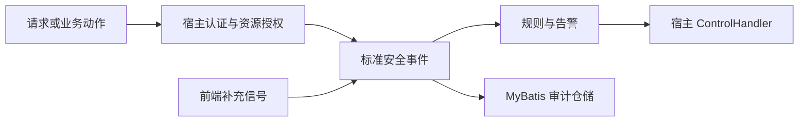

# 架构与运维说明

## 1. 目标与边界

组件把异常访问处理拆成事件采集、确定性规则、告警、控制和审计五个阶段。它不替代宿主的认证、会话管理、数据权限、网关限流或业务端点；这些能力仍由宿主系统拥有并作最终决定。

`ResourceAccessGuard` 先取得宿主 `ResourceScopeAuthorizer` 的结论，再记录事件。授权器异常、空结论或未配置时默认拒绝；监测失败不会将宿主拒绝变为允许。浏览器信号只能补充事实，不能决定身份、IP、角色、风险或授权结果。

## 2. 运行时模型

Starter 默认注册规则库、`SecurityMonitor`、告警生命周期服务、前端信号记录器和请求元数据拦截器。检测到 `SqlSessionFactory` 时使用 MyBatis 仓储；未检测到时使用内存仓储，后者不具备生产审计、重启保留或跨实例聚合能力。

`OBSERVE` 适用于接入和调优：记录事件、生成告警、保留审计，但不发起自动控制。`ENFORCE` 需要至少一个宿主 `ControlHandler`，且处理器必须支持幂等键重放。没有处理器时 Starter 直接拒绝启动。

## 3. 上线与迁移

1. 为系统分配稳定的 `system-id`，并按 Boot 版本引入唯一 Starter。
2. 将 `monitoring-schema.sql` 转为受版本控制的数据库迁移；先在预发布库验证建表、索引和运行账户权限。
3. 实现身份、资源授权、受信任代理和控制 SPI；前端接收端自行完成认证、限流和 Schema 校验。
4. 以 `OBSERVE` 上线，核对事件字段、告警数量、规则误报和控制候选项。
5. 对每个已启用控制动作做失败、超时、重复投递和回滚演练，确认后切换 `ENFORCE`。

组件升级或规则、Schema、控制 TTL 变更时，先执行迁移和回归测试，再在预发布 `OBSERVE` 对照。Boot 2 升级到 Boot 3 时替换 Starter、迁移宿主 `javax.*` Servlet/MVC 引用到 `jakarta.*`，并使用 JDK 17 编译。不要修改已执行的历史迁移；新增迁移应保持可追溯。

## 4. 安全与数据治理

事件属性会拒绝包含密码、令牌、Cookie、密钥等凭据关键词；宿主仍应在进入组件前最小化字段。禁止记录完整敏感请求/响应体。`trusted-proxies` 必须最小化配置，不能为了获取客户端 IP 而信任所有来源。

告警处置经 `AlertLifecycleService` 追加写入 `alert_disposition`。关闭告警需证据摘要；事件、处置、控制记录和白名单的留存、归档或删除遵从组织的数据保留与审批政策。

## 5. 值守检查清单

- 每次发布前：执行 `mvn clean verify -DskipTests=false`，检查迁移顺序和 Starter 版本。
- 每日：核对事件写入、告警量、控制成功/失败和数据库容量趋势；按 `request_id`、`trace_id` 关联宿主日志。
- 每周：复核白名单到期、受信任代理范围、控制处理器幂等性和高风险规则的误报。
- 每次告警关闭：记录操作人、处置说明和证据摘要；不要修改原始事件。
- 发生 MyBatis、控制或授权集成故障时：保留宿主认证和授权的安全默认值，先恢复审计链路，再评估是否恢复 `ENFORCE`。
