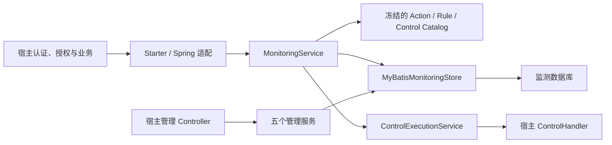
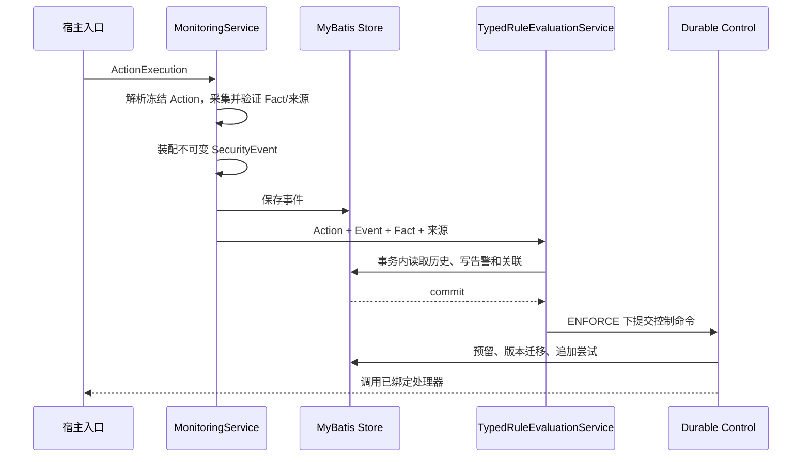

# 架构与运维说明

本文面向组件维护者、持久化负责人和运维负责人。宿主接入步骤见[集成指南](集成指南.md)。

## 1. 责任分离



- `api` 只放框架无关契约和不可变输入/输出。
- `core` 负责用例与领域规则，不依赖 Spring、Servlet 或 MyBatis。
- `mybatis` 是唯一生产持久化适配器，负责 PO/领域转换和事务。
- Starter 只组装依赖和 Web 适配，不拥有业务授权策略。
- 宿主拥有身份、资源授权、实际控制、副作用和管理端 URL。

## 2. 运行链路



事件先持久化，再进行规则评估。历史查询会按事件 ID 用当前内存事件替换数据库回读副本，避免数据库 `TIMESTAMP` 精度截断或舍入使当前事件被窗口上界排除。

Fact 来源按 Fact 保留并传给 `RuleEvaluationContext`。规则同时检查 Action 允许来源与自身接受来源；缺失或来源不合格时只跳过相关规则，不伪造服务端来源。

## 3. 事务边界

`MonitoringTransaction.required(...)` 是规则评估的一致性边界：历史读取、告警创建/更新和事件关联在同一 MyBatis 管理会话中提交。通知与宿主控制发生在提交之后，避免外部副作用先于审计事实。

控制使用独立持久状态机和乐观版本：

```text
PENDING -> WAITING_APPROVAL -> EXECUTING -> SUCCEEDED
                         |             -> FAILED -> retry
                         -> REJECTED
```

每次尝试追加到 `control_action_attempt`。幂等键具有唯一约束；并发领取或状态迁移只能有一个版本成功。

管理写操作通过 `MonitoringTransaction` 组合业务状态和 `management_audit`。授权拒绝也必须留下独立 `DENIED` 记录。管理审计是追加写，不提供更新或删除 Mapper。

监测事务不加入宿主业务事务。确需跨资源原子时，由宿主使用 transactional outbox 或经过批准的适配器。

## 4. 启动期严格校验

启动时按以下顺序失败：

1. 缺少 `SqlSessionFactory`，不创建运行时。
2. Action Catalog 未冻结、类型/编码重复或 Action 定义不完整。
3. `FactBinding` 指向非法 Action/Contract，或声明为空。
4. `ENFORCE` 缺少任一内置规则可能产生的可执行控制处理器。
5. 通用 IP 控制配置与模式、TTL、路径或规则白名单不一致。

框架默认控制只产生可审计的跳过结果，不满足 ENFORCE。生产处理器必须是宿主 Bean 或明确启用的通用处理器。

## 5. MyBatis 与 Schema

`mybatis/src/main/resources/db/monitoring-schema.sql` 是新环境基线；已有环境使用 `db/migration` 下的增量脚本。组件不自动执行 DDL。

核心表：

| 聚合 | 表 |
| --- | --- |
| 事件 | `security_event` 及 role/attribute/input_issue 子表 |
| 告警 | `security_alert`、`alert_event_link`、`alert_disposition` |
| 控制 | `control_action`、`control_action_attempt` |
| 白名单/规则 | `security_whitelist`、规则版本表 |
| 管理审计 | `management_audit` |

生产升级必须记录迁移版本、执行人、开始/结束时间、校验结果和回滚点。不要修改已执行的历史迁移。

## 6. 安全约束

- 身份、角色、会话、源 IP 和资源授权只来自服务端可信上下文。
- 前端信号使用独立 Action，不能参与内置规则或控制。
- 禁止事件包含密码、令牌、Cookie、密钥和原始敏感载荷。
- 管理 Actor 必须从服务端认证上下文创建；请求参数不能决定 actor/system scope。
- `ResourceAccessGuard` 默认拒绝，监测故障不能扩大授权。
- 控制处理器必须按幂等键执行并验证主体、规则和 TTL。

## 7. 值守

发布前：

- 执行 `mvn clean verify -DskipTests=false`；
- 在目标数据库验证迁移、索引、事务和并发控制；
- 核对 ENFORCE 所需六类处理器及幂等行为；
- 演练管理授权拒绝、控制失败/重试和数据库不可用；
- 检查 Boot 2/3 依赖与 Servlet 命名空间。

日常观测事件写入延迟、规则命中量、告警积压、控制失败/等待审批数量、管理拒绝审计和数据库容量。故障时保持宿主认证与授权安全默认值；无法保证控制完整性时退回 `OBSERVE`，不得以本地内存状态替代数据库事实。
