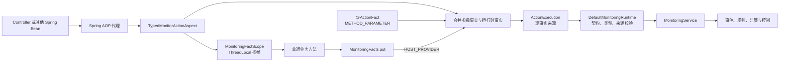
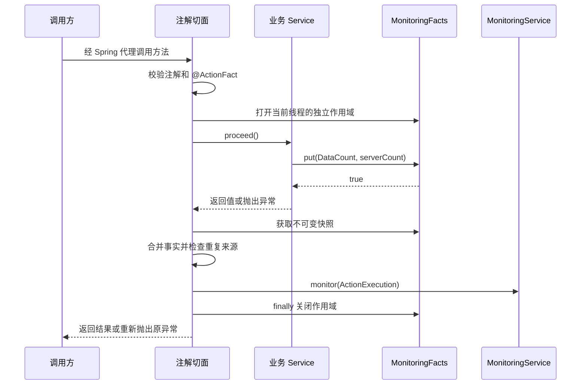

# 注解监听与运行时事实作用域

本文独立说明 `@MonitorAction`、`@ActionFact`、`MonitoringFacts` 和
`MonitoringRecorder` 的架构、调用关系与使用边界。适用于 Boot 2.1、Boot 2.7 和 Boot 3
三个 Starter。

## 1. 解决的问题

有些事实只能在方法执行过程中得到，例如最终查询条数、实际影响行数或下游处理结果。此时既不应
把客户端字段直接标成可信事实，也不必为了追加一个事实手工组装完整的 `ActionExecution`。

对于同步的 Spring Bean 方法，可以在 `@MonitorAction` 方法体内调用静态 API：

```java
@Service
public class ReportService {
    @MonitorAction(BuiltInActions.SensitiveView.class)
    public ReportResult view(String reportId) {
        ReportResult result = repository.load(reportId);
        MonitoringFacts.put(BuiltInFacts.DataCount.class,
            Long.valueOf(result.getRows().size()));
        return result;
    }
}
```

这里静态的是 `MonitoringFacts.put(...)`。被监听的业务方法不能是静态方法，并且必须通过 Spring
代理调用。

## 2. 总体架构



| 模块 | 责任 |
| --- | --- |
| `api` | 定义 Action、Fact、`ActionExecution` 以及逐事实来源契约 |
| `spring-support` | 提供 `MonitoringFacts`、作用域生命周期和 `MonitoringRecorder` |
| 三个 Starter | 用切面打开/关闭作用域，识别方法结果并提交事件 |
| `core` | 校验事实是否属于 Action、类型与来源是否合法，并执行监测流程 |
| `mybatis` | 持久化每条事实及其独立来源 |

## 3. 调用时序



返回 `ResponseEntity` 时，切面把 401/403 识别为 `DENIED`，其他 4xx/5xx 识别为
`FAILURE`。业务方法抛出异常时，切面仍会用已经追加的运行时事实记录失败事件，然后重新抛出原异常；
监测过程自身的运行时异常会附加为 suppressed exception。

## 4. 四种事实入口如何选择

| 场景 | 入口 | 来源 | 适用范围 |
| --- | --- | --- | --- |
| 方法调用前已经存在的稳定参数 | `@ActionFact` | `METHOD_PARAMETER` | 同步代理方法，受限属性路径 |
| 注解方法执行中得到的服务端事实 | `MonitoringFacts.put` | `HOST_PROVIDER` | 当前同步注解作用域 |
| 同步 Servlet 请求中需要显式记录完整结果 | `MonitoringRecorder.record` | `HOST_PROVIDER` | 自动读取当前请求与身份上下文 |
| 异步任务、消息消费或需完全控制上下文 | `MonitoringService.monitor` | 调用方显式指定 | 完整程序化入口 |

固定参数示例：

```java
@MonitorAction(BuiltInActions.SensitiveView.class)
public Result view(
        @ActionFact(BuiltInFacts.Sensitive.class) String sensitive) {
    return loadResult();
}
```

简化的显式入口示例：

```java
ActionFacts facts = ActionFacts.builder()
    .put(BuiltInFacts.ResourceId.class, reportId)
    .put(BuiltInFacts.DataCount.class, Long.valueOf(rows))
    .build();

monitoringRecorder.record(BuiltInActions.ReportExport.class,
    ActionOutcome.success(elapsedMs), facts);
```

`MonitoringRecorder` 是 `monitoring.monitor(ActionExecution.of(...))` 的同步 Servlet 便捷形式。
它不会建立 `MonitoringFacts` 作用域，也不适用于离开请求线程后的任务。

## 5. 作用域、并发与冲突规则

- 每次被代理的注解方法调用都会创建独立栈帧；嵌套代理调用只写入最内层作用域，内外事实不会覆盖。
- 不同线程使用不同的 `ThreadLocal` 栈，因此并发请求不会共享事实。
- 同一作用域内重复追加同一种 Fact 会抛出 `IllegalStateException`，不会静默覆盖。
- `@ActionFact` 与 `MonitoringFacts.put` 提供同一种 Fact 时也会抛出冲突异常。
- 作用域严格按栈顺序关闭；最外层关闭后会移除线程状态，避免线程池复用时泄漏。
- `put` 拒绝空 Fact 类型和空值，事实的目录、值类型、Action 契约和允许来源仍由运行时统一校验。

建议检查布尔返回值，尤其是可被非代理路径调用的公共业务代码：

```java
boolean accepted = MonitoringFacts.put(
    BuiltInFacts.DataCount.class, Long.valueOf(rows));
```

没有活动的注解作用域时，`put` 返回 `false` 并记录 WARN；警告不会输出 Fact 值，避免敏感数据进入
日志。此时不会产生事件，也不会对后续监测产生任何作用。

## 6. 普通方法与代理边界

监听不局限于 Controller。任何被 Spring 管理、可由 AOP 代理拦截的实例方法都适用，推荐把注解放在
实际得到业务结果的 Service 公共方法上。

以下调用不会建立作用域：

- 静态业务方法；
- `private` 或不能被当前代理方式拦截的方法；
- 使用 `new` 手工创建、未交给 Spring 管理的对象；
- 同一个 Bean 内通过 `this.method()` 发起的自调用；
- 已离开原调用线程的异步回调、线程池任务或消息处理。

同类自调用应拆到另一个 Spring Bean，或通过已注入的代理调用。异步场景应显式构造可信的
`MonitoringRequestContext`、`IdentityContext` 和 `ActionExecution`，使用
`MonitoringService.monitor`，不要跨线程传递作用域对象。

## 7. 安全边界

- `MonitoringFacts` 的来源固定为 `HOST_PROVIDER`，只应写入服务端已验证或计算的事实。
- 浏览器提交的资源 ID、行数、身份、租户或权限状态不能因为在 Service 中重新读取就自动变可信。
- `@MonitorAction` 负责观察和记录，不替代宿主认证、资源授权、事务或控制副作用。
- 不要写入密码、Token、Cookie、密钥、原始请求/响应载荷或未经批准的异常文本。
- Fact 必须预先注册，并且 Action 必须声明允许该 Fact 与 `HOST_PROVIDER` 来源。

## 8. 可运行用例

Boot 2 和 Boot 3 集成审计中的 IA-04 都通过普通 `AnnotatedMonitoringService` 验证该流程：请求携带
伪造行数 `5000`，Service 在监听作用域中追加服务端行数 `37`，最终持久化来源为
`HOST_PROVIDER`。

- [Spring 2 Service](../integration-audit/spring2-web/src/main/java/io/github/jasper/monitoring/audit/spring2/monitoring/AnnotatedMonitoringService.java)
- [Spring 3 Service](../integration-audit/spring3-web/src/main/java/io/github/jasper/monitoring/audit/spring3/monitoring/AnnotatedMonitoringService.java)
- [Spring 2 验收测试](../integration-audit/spring2-web/src/test/java/io/github/jasper/monitoring/audit/spring2/Spring2AuditWebAcceptanceTest.java)
- [Spring 3 验收测试](../integration-audit/spring3-web/src/test/java/io/github/jasper/monitoring/audit/spring3/Spring3AuditWebAcceptanceTest.java)

```bash
mvn -pl :sys-abnormal-access-monitoring-integration-audit-spring2-web -am test
mvn -pl :sys-abnormal-access-monitoring-integration-audit-spring3-web -am test
```
