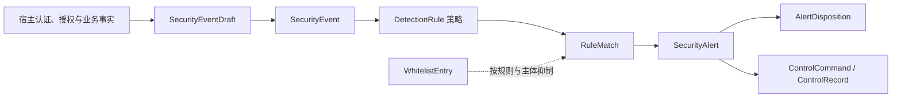

# 领域模型与数据设计

本文以当前实现为准，补充[架构与运维说明](架构与运维说明.md)中的运行边界；它不引入新的运行时组件或数据库迁移。

## 限界上下文与协作

监测上下文负责接收已脱敏的事件、基于历史做确定性判定、维护告警闭环并记录控制结果。宿主上下文仍负责认证、资源授权、业务数据查询和实际阻断。`SecurityEventDraft` 是宿主输入，`SecurityEvent` 是服务端盖章后的审计事实；`DefaultSecurityMonitor` 先落事件，再读取以事件时间为基准的最近 24 小时历史进行判定。[监测编排](../core/src/main/java/io/github/jasper/monitoring/core/application/DefaultSecurityMonitor.java)

当前部署边界是**一个宿主系统对应一个监测 Schema/数据库**。虽然事件行保存 `system_id`，但历史查询、开放告警指纹和白名单查询均未按它隔离；共享库会混合不同系统的规则历史、告警和抑制结果。若要共享库，必须以独立迁移为所有相关表、查询与索引补齐系统维度；当前实现不支持该部署方式。

`DetectionRule` 是唯一的通用规则扩展点：规则提供稳定 `ruleId`，对当前事件和已排序历史返回 `Optional<RuleMatch>`。规则不得直接写库、执行控制或信任前端身份字段；风险等级、主体、资源范围、控制动作和 TTL 由 `RuleMatch` 说明。Starter 会收集基线、`DetectionRule` Bean 和 `InternalRuleContributor` 规则到 `InternalRuleRegistry`，并在创建监测器前冻结，运行中不可由管理操作改写。[规则契约](../core/src/main/java/io/github/jasper/monitoring/core/domain/rule/DetectionRule.java) [基线规则](../core/src/main/java/io/github/jasper/monitoring/core/domain/rule/DefaultRuleCatalog.java)

需要参与分析的业务事实应以审核后的非敏感属性写入事件。`EventEnricher` 目前只有 SPI 声明，Starter 和核心编排尚未自动调用它；因此宿主适配器必须在调用 `SecurityMonitor.record()` 前富化 `SecurityEventDraft`。规则不能假定 SPI Bean 会被自动执行。[富化 SPI](../api/src/main/java/io/github/jasper/monitoring/api/EventEnricher.java)

## 聚合与不变量

| 聚合 | 所有者与子项 | 不变量 |
| --- | --- | --- |
| 安全事件 | `SecurityEvent`；角色和扩展属性为子项 | 已校验和脱敏的草稿才可被接收；事件 ID、系统 ID 与接收时间由服务端写入；已记录事件不覆盖。 |
| 安全告警 | `SecurityAlert`；事件关联与处置记录为子项 | 指纹为 `ruleId|subject|resourceKey`；重复命中刷新同一开放告警的计数与最后时间；处置只追加，关闭必须有证据摘要。 |
| 控制执行 | `ControlRecord`，含命令与执行结果 | 同一幂等键只执行一次；重放必须返回已持久化结果。 |
| 白名单 | `WhitelistEntry` | 必须指定到期时间；仅在 `expires_at` 严格晚于判定时间时抑制规则。 |

“每个开放指纹只有一个告警”是领域不变量，但当前数据库未对开放状态建立唯一约束；多实例并发部署时，应在数据库方言允许的条件下用迁移增加相应约束或采用串行化更新，不能只依赖先查后插。当前 `security_rule` 可由管理 Mapper 查询、追加新版本和动态启停；它在管理视图中是 `PERSISTED / mutable=true`，而运行规则仍来自冻结的 `DefaultRuleCatalog` 与宿主注册的 `DetectionRule`，不会自动从该表加载。[管理 Mapper](../mybatis/src/main/java/io/github/jasper/monitoring/mybatis/MonitoringAdministrationMapper.java)

## 表映射、索引与留存

| 表 | 领域映射与现有约束/索引 |
| --- | --- |
| `security_event` | 事件根，主键 `event_id`；`idx_security_event_occurred_at` 支持时间窗读取，`idx_security_event_subject_at` 支持按用户/IP 与时间关联。 |
| `security_event_role`、`security_event_attribute` | 事件子项，复合主键均以 `event_id` 开头。 |
| `security_alert`、`alert_event_link`、`alert_disposition` | 告警摘要、事件关联和追加处置；前者按 `fingerprint,status` 查询，处置按 `alert_id,created_at` 读取。 |
| `control_action` | 控制审计；`idempotency_key` 唯一，防止重复执行。 |
| `security_whitelist` | 临时抑制；按 `rule_id,subject,expires_at` 查询。 |
| `security_rule` | 规则版本与管理审计；复合主键为 `rule_id,rule_version`。 |

完整 DDL 位于[监测表结构](../mybatis/src/main/resources/db/monitoring-schema.sql)。当前脚本没有分区、归档任务或自动删除策略，只有白名单的逻辑到期。因此留存任务必须由受审批的运维迁移或作业承担：保留窗口不得短于最大规则回溯窗口；归档或删除事件时同时处理角色、属性和关联记录；处置与控制记录按审计政策独立留存。不要假定数据库外键或级联删除存在。

## 核心域最小验收矩阵

| 用例 | 输入/前置条件 | 预期结论 |
| --- | --- | --- |
| AC-01 事件边界 | 缺失必填字段或携带不安全属性键 | 草稿构建拒绝；通过的事件为不可变、已脱敏事实。 |
| AC-02 `AUTH-01` | 同一用户五分钟内 5 次登录失败 | 前 4 次无告警；第 5 次产生一条中风险告警，候选动作含验证码和限流；后续命中只刷新该告警。 |
| AC-03 `AUTH-02` | 同一 IP 十分钟内跨至少 10 个账号失败，失败率至少 80% | 告警主体为 `ip:<sourceIp>`，候选限流 TTL 为 30 分钟。 |
| AC-04 `EXPT-01` | 导出量不少于 5,000，或敏感级别为 `HIGH`；`ENFORCE` 已配置拒绝处理器 | 产生高风险告警；同一控制幂等键仅调用宿主处理器一次。 |
| AC-05 白名单 | `AUTH-03` 的有效与过期白名单各一条 | 有效条目抑制匹配；过期条目不抑制，仍产生告警。 |
| AC-06 告警闭环 | `NEW -> ACKNOWLEDGED -> IN_PROGRESS -> CLOSED`，最后一步带证据 | 状态转换合法，新增三条处置历史，原始事件不变；非法转换被拒绝。 |
| AC-07 MyBatis 往返 | 已迁移 schema，保存带角色、属性、告警、控制和白名单的事件 | 查询按时间还原事件子项；控制幂等键和白名单到期语义保持一致。 |

上述核心行为已有对应的[核心测试](../core/src/test/java/io/github/jasper/monitoring/core/DefaultSecurityMonitorTest.java)、[生命周期测试](../core/src/test/java/io/github/jasper/monitoring/core/AlertLifecycleServiceTest.java)和[MyBatis 集成测试](../mybatis/src/test/java/io/github/jasper/monitoring/mybatis/MyBatisMonitoringRepositoryTest.java)。

## 方案附录 B 可追溯性

| 方案用例 | 归属与最小验证 |
| --- | --- |
| TC-01、TC-02、TC-07、TC-08、TC-09、TC-12、TC-13 | 核心规则与控制幂等性；由 `DefaultSecurityMonitorTest` 覆盖五次失败、同 IP 多账号、120 次查询、单次/累计导出、过期白名单和幂等重放。 |
| TC-03、TC-06、TC-10、TC-16 | 规则需要宿主提供停用状态、顺序访问、高权限标记或规则变更事实；由 `EventConditionRule` 或 `WindowAggregateRule` 处理已脱敏属性。 |
| TC-04、TC-05 | 宿主后端鉴权与资源范围校验；组件通过 `ResourceAccessGuard` 记录拒绝事件，但不替代宿主授权器。 |
| TC-11 | 宿主 `ControlHandler` 对接会话存储并执行撤销；组件只提供 `REVOKE_SESSION` 指令、TTL 与幂等记录。 |
| TC-14 | 通知失败不会回滚告警或业务；有限重试由宿主 `NotificationChannel` 实现，不在核心规则层伪造重试队列。 |
| TC-15 | `SecurityEventDraft` 的字段清洗与属性白名单负责禁止凭据、Cookie、Token 与不安全键进入事件。 |
| TC-17 | 以配置重启或受控发布切换 `OBSERVE`/`ENFORCE`；切换前必须验证 `ControlHandler`，不能由规则自行改变运行模式。 |
| TC-18 | 告警确认、处置与关闭由 `AlertLifecycleService` 追加处置历史，原始事件保持不可变。 |
