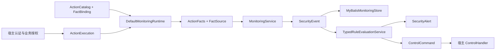

# 领域模型与数据设计

本文只描述当前可运行的强类型模型、持久化边界和领域不变量。集成步骤见[集成指南](集成指南.md)，部署与故障处理见[架构与运维说明](架构与运维说明.md)。

## 权责链

宿主系统拥有认证、业务授权、可信事实提取和控制执行权；组件拥有声明扫描、规则判定、告警闭环、控制幂等和管理审计；MyBatis 是唯一生产持久化实现。

`MonitoringService` 的固定顺序是解析动作、收集事实、组装事件、持久化事件、评估合格规则。事件写入后，规则和控制失败不得伪装成业务操作未发生。通知是尽力而为，失败不回滚已持久化的监测结果。

## 强类型动作与事实

内置动作和宿主动作使用同一类型体系：具体动作实现 `ActionType`，共享语义通过 `ActionContract` 表达。内置动作类是库拥有的最终类型；宿主扩展应定义自己的最终动作类，不得使用字符串冒充动作类型。[内置动作](../api/src/main/java/io/github/jasper/monitoring/api/action/BuiltInActions.java)

`ActionDefinition` 声明稳定的 `domain:verb` 代码、事件类型、资源类型、失败策略、可参与规则及所需事实。`ActionCatalog` 在运行前完成重复注册、契约合并和定义冲突校验；运行时不接受未注册动作。[动作定义](../api/src/main/java/io/github/jasper/monitoring/api/action/ActionDefinition.java)

事实由 `FactType<T>` 同时限定标识和值类型。`FactBinding` 明确绑定目标、提供器、可产出的事实集合和统一的 `FactSource`：

- `forAction` 只绑定一个具体且 `final` 的动作，不影响同契约的其他动作。
- `forContract` 显式绑定一个具体契约，适用于实现该契约的所有动作。
- 提供器返回未声明事实、重复事实或动作不允许的来源时，启动扫描或运行时收集必须拒绝。
- `CLIENT_SUPPLEMENTAL` 只作补充证据；身份、权限、资源范围及阻断依据必须来自服务端可信来源。

`FactCatalog` 是事实校验和持久化元数据的唯一注册表；每个 Fact 必须有唯一类型、稳定 key 和受控 codec。`MonitoringRuntimePort.FactCollection` 保证每个已收集事实恰有一个来源和一个编码快照。`RuleDefinition` 再声明规则适用的动作或契约、必需事实、可接受来源、历史窗口、阈值、风险和控制。只有动作关系、事实集合和来源约束全部满足，规则才有资格执行。[事实目录](../api/src/main/java/io/github/jasper/monitoring/api/fact/FactCatalog.java) [事实绑定](../api/src/main/java/io/github/jasper/monitoring/api/fact/FactBinding.java) [规则定义](../api/src/main/java/io/github/jasper/monitoring/api/rule/RuleDefinition.java)

## 聚合与不变量

| 聚合 | 核心不变量 |
| --- | --- |
| 安全事件 | `eventId`、`systemId` 和接收信息由服务端确定；事实值和来源校验后才持久化；已记录事件不可覆盖。 |
| 安全告警 | 指纹由规则、主体和资源范围决定；重复命中刷新同一开放告警并追加事件关联；处置使用期望版本防止丢失更新。 |
| 控制执行 | 控制先持久化再交给宿主 `ControlHandler`；同一幂等键只能执行一次；每次尝试单独留痕。 |
| 白名单 | 必须限定系统范围、规则、主体和到期时间；只在判定时刻仍有效时抑制。 |
| 管理审计 | 每个查询和变更都记录服务端识别的操作者、系统范围、资源、结果及原因；拒绝访问也必须记录。 |

`OBSERVE` 只记录事件、告警和候选控制。`ENFORCE` 启动前必须为所有内置可执行控制注册非回退 `ControlHandler`；缺少任一处理器即拒绝启动，避免部分执行造成错误安全预期。

## 持久化模型

生产运行时只依赖 `MyBatisMonitoringStore` 及管理仓储，不提供内存实现。测试中的内存对象仅是单元测试替身，不是可配置的生产后端。完整 DDL 位于[monitoring-schema.sql](../mybatis/src/main/resources/db/monitoring-schema.sql)。

| 表 | 所有权与约束 |
| --- | --- |
| `monitoring_security_event` | 事件根；按系统和时间建立索引。 |
| `monitoring_security_event_fact` | 强类型事实值及来源；以事件和事实类型关联。 |
| `monitoring_security_event_role`、`monitoring_security_event_attribute`、`monitoring_security_event_input_issue` | 事件的角色、受控扩展属性和输入问题。 |
| `monitoring_security_rule` | 可查询的规则版本和启停状态；变更通过管理服务审计。 |
| `monitoring_security_alert`、`monitoring_alert_event_link`、`monitoring_alert_disposition` | 告警、命中事件和追加式处置历史。 |
| `monitoring_control_action`、`monitoring_control_action_attempt` | 持久控制及每次执行尝试；幂等键防止重复执行。 |
| `monitoring_security_whitelist` | 有时限的规则抑制，具有稳定业务标识。 |
| `monitoring_notification_delivery` | 通知交付状态。 |
| `monitoring_management_audit` | 管理查询、变更和拒绝记录，按系统与时间检索。 |

当前部署边界是一个宿主系统对应一个监测 Schema/数据库。事件和管理审计查询虽携带 `systemId`，但开放告警指纹和运行时白名单查询尚未把系统范围作为完整复合键，因此禁止多个宿主共享同一 Schema。若未来支持共享库，必须通过独立迁移同时修改所有相关键、查询、唯一约束和索引，不能只依赖事件表的系统索引。Schema 不负责自动归档；保留窗口不得短于最大规则回溯窗口，清理作业必须同时处理事件子表和关联表。

## 管理服务边界

Controller 层只把宿主已认证身份转换为 `ManagementActor`，构造有界查询或带期望版本的命令，然后调用以下 API 接口：[管理 API](../api/src/main/java/io/github/jasper/monitoring/api/management)

| 服务 | Controller 可直接承接的职责 |
| --- | --- |
| `SecurityEventQueryService` | 有界时间窗内查询事件及详情。 |
| `AlertManagementService` | 查询、确认、调查、关闭和误报处置。 |
| `ControlManagementService` | 查询、审批、拒绝和重试控制。 |
| `WhitelistManagementService` | 查询、授予和撤销临时白名单。 |
| `RuleCatalogService` | 查询规则及受控启停。 |

Controller 不得自行拼接 Mapper、绕过 `ManagementAuthorizer`、信任请求体中的操作者或系统范围，也不得自行实现幂等、版本冲突和审计。前端形态由宿主决定，服务契约保持与 Web 框架无关。

## 最小验收矩阵

| 用例 | 必须验证的结果 |
| --- | --- |
| 未注册动作或冲突定义 | 启动扫描失败，不进入可服务状态。 |
| 缺失事实、未声明事实或来源不被允许 | 按动作失败策略拒绝或降级观察；不触发依赖该事实的规则。 |
| 内置导出及自定义导出动作 | 二者通过 `ExportContract` 共享规则先决条件，自定义动作仍保留独立类型身份。 |
| 相同事实来自客户端补充数据 | 不能满足只接受可信请求、身份或宿主提供器的规则。 |
| 规则阈值与历史窗口 | 当前事件只计一次；MyBatis 时间精度往返不改变结果。 |
| `ENFORCE` 控制 | 启动时完整校验处理器，运行时控制持久化且幂等，失败尝试可审计。 |
| 管理查询和变更 | 服务端身份授权、有界分页、系统隔离、期望版本及成功/拒绝审计均生效。 |
| Boot 2/Boot 3 集成 | 相同强类型契约、MyBatis 行为和 HTTP 管理验收均通过。 |

对应自动化覆盖位于[核心测试](../core/src/test/java/io/github/jasper/monitoring/core)、[MyBatis 测试](../mybatis/src/test/java/io/github/jasper/monitoring/mybatis)和[集成审计](../integration-audit)。
